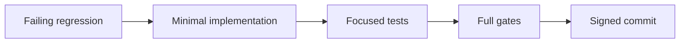
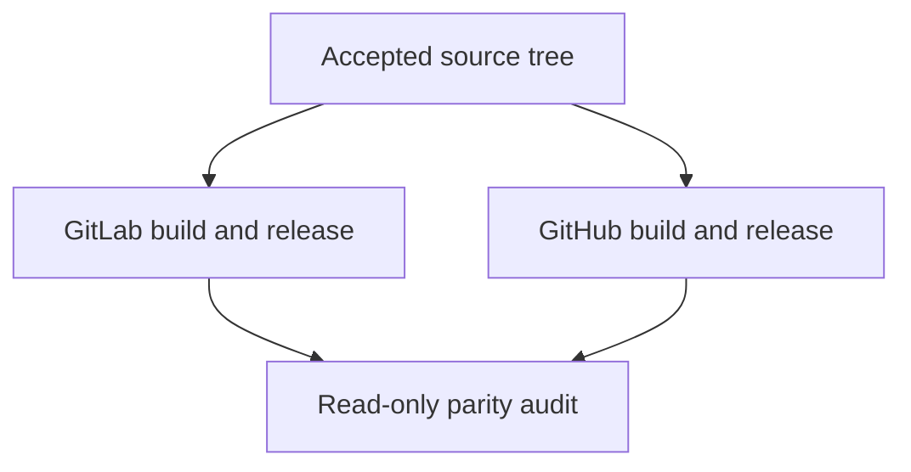

# Contributing to Codex Responses Proxy

This guide is for repository development. Product use belongs in the
[README](README.md).

## Boundary

Contributions may change only the proxy data plane, native lifecycle, product
CLI, and repository-owned delivery system.

| Never mutate                                               | Reason                                                  |
| ---------------------------------------------------------- | ------------------------------------------------------- |
| Codex JSONL, SQLite, history, stored items, model metadata | Portability belongs at the network edge                 |
| Client configuration                                       | The proxy is not a client control plane                 |
| Provider credentials                                       | Credentials pass through; the proxy does not store them |
| Another repository environment                             | Verification must be reproducible from this repository  |

## Development environment

Requirements:

- `mise` at or above the minimum version declared in `mise.toml`;
- Git and OpenSSH for release-provenance work.

`mise.toml` selects the default and release Python, uv, Node, and standalone
verification tools. `.python-versions` is the compatibility-matrix authority;
Nox reads it and uses the uv backend to provision each isolated interpreter
session.

Bootstrap once:

```bash
mise install --locked
mise run bootstrap
```

`mise.toml` and `mise.lock` own language runtimes and standalone executables.
`package.json` and `package-lock.json` own OpenSpec, Prettier, and their complete
npm graph. Governance invokes Node tools through `npm exec --offline`, so local,
GitHub, GitLab, POSIX, and Windows use the same repository installation.
The `mise.toml` tasks pass the exact mise Python installation to uv and bind the
project environment to this worktree's `.venv`. An activated environment or
inherited Python override does not select the development interpreter. Nox owns
disposable `.nox/<session>` environments and selects compatibility interpreters
independently. Download caches may be shared; mutable environments are local to
their worktree or Nox session. Repeat bootstrap after dependency locks change;
editing checks do not reinstall Node dependencies.

Run the repository-owned gates:

```bash
mise run quick
mise run check
```

`quick` is the editing feedback loop. `check` calls Nox's `full` admission and avoids
rerunning `quick` or the Python 3.12 behavior inventory already exercised by
strict branch-aware coverage.

`mise run release` builds and verifies a native release asset without service
registration. `mise run native` additionally exercises the real host service
lifecycle; run it only on an explicitly authorized test host. Neither task
publishes a release or upgrades an installed product.

Nox installs a non-editable wheel in isolated environments. Do not add
`PYTHONPATH`, user-site fallback, or another repository's virtual environment
to make a test pass.

Build output, verification results, temporary files, and their cleanup follow
the [evidence storage policy](docs/evidence/evidence-policy.md#storage-and-retention).
Mutable output stays local to this worktree; ETHOS selects the shared storage
for its own evidence and coordination.

## Change method



- Add a failing regression before changing behavior.
- Keep expected failures free of traceback and warning noise.
- Keep statement and measured branch coverage strictly above 95%.
- Use `type(scope): imperative subject`; `.config/quality/policy/commits.toml` is the machine-enforced grammar.
- Preserve released history in Git, signed Forge records, the Changelog,
  completed OpenSpec lifecycle records, and admitted evidence. Keep historical
  carriers outside current mutation authority; remove only redundant current
  projections after their surviving semantics have an authoritative owner.

## Provider extension

The provider registry is
`src/codex_responses_proxy/providers/manifest.toml`.

| Extension                                     | Required change                                         |
| --------------------------------------------- | ------------------------------------------------------- |
| Ordinary OpenAI-compatible Responses provider | One `[providers.<slug>]` manifest table                 |
| Provider-specific wire behavior               | One pure policy module plus its manifest `policy` field |

An ordinary provider must not require:

- a CLI command;
- an environment variable;
- an installer case;
- a release-script branch;
- a provider-name switch in relay or protocol code.

Policy modules are pure. They do not own HTTP dispatch, mutable state,
credentials, host paths, or Forge identity.

## Source organization

| Package     | Responsibility                                                  |
| ----------- | --------------------------------------------------------------- |
| `cli`       | Public command grammar and human/JSON projection                |
| `providers` | Declarative provider registry and optional wire policies        |
| `protocol`  | Provider-portable request and response projection               |
| `relay`     | HTTP/SSE exchange, admission, retry, and cooldown               |
| `service`   | Listener process, health, logs, and handoff protocol            |
| `lifecycle` | Artifact admission, install, supervision, reload, and uninstall |

Tests mirror these semantic packages. New generic buckets, forwarding modules,
compatibility aliases, and one-caller abstractions require an independently
proved invariant; otherwise delete them.

Design deep modules: a small intent-oriented interface owns the corresponding
invariants, effects, rollback, and cleanup. Callers should not coordinate private
steps or repeat its policy. Split at independent responsibilities, not arbitrary
file-size targets; merge layers that only forward arguments without hiding
meaningful complexity.

Before adding any file, directory, schema, carrier, helper, abstraction, state,
or compatibility path, establish all three conditions:

1. Official OpenSpec artifacts and existing tool-native configuration cannot
   express the required behavior.
2. No existing authority can express it through deletion, reuse, merger, or
   simplification.
3. The new entity owns one necessary invariant and enables the replaced entity
   to be removed.

If any condition is unproved, do not add the entity. Convenience, historical
existence, and speculative future use are not necessity.

## Release

`VERSION` is the version source of truth. `CHANGELOG.md` records published
history, not planned work.

GitLab and GitHub are independent publication planes:



Neither plane waits for, downloads from, authenticates to, or publishes through
the other. See [Forge operations](docs/operations/forge-operations.md).

## Review checklist

- [ ] Product and developer interfaces remain separate.
- [ ] Human and JSON output derive from the same result model.
- [ ] No personal identity, local path, credential, or private Forge coordinate is tracked.
- [ ] No provider identity drives generic behavior.
- [ ] Current docs match code, tests, CLI help, and release assets.
- [ ] Focused tests and all affected gates pass.
