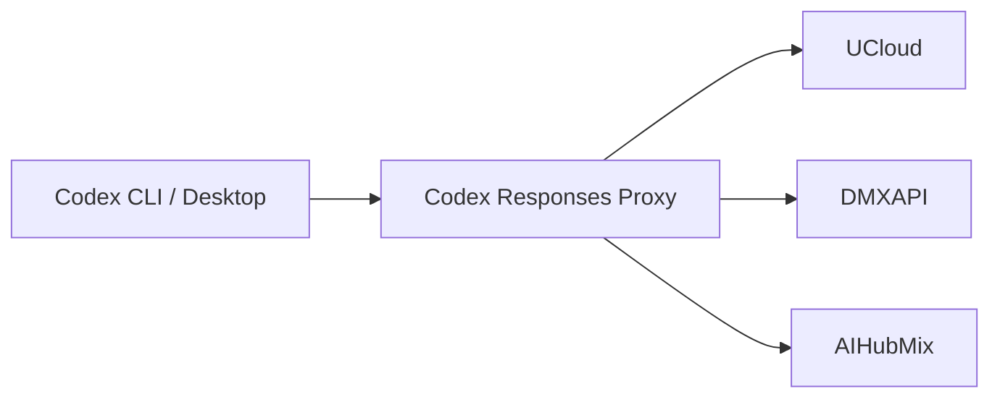

# Codex Responses Proxy

A local compatibility gateway for third-party OpenAI Responses APIs.

Licensed under [MIT](LICENSE). Forge coordinates and publication actors are
deployment context, not product identity.

It keeps Codex traffic provider-portable without editing conversation JSONL,
SQLite state, history, stored items, or model metadata.



## Product boundary

| Owner | Responsibility |
| --- | --- |
| Codex | Conversations, tools, and per-conversation model selection |
| AIGW or another client control plane | Credentials, provider selection, and client configuration |
| Codex Responses Proxy | Responses normalization, replay portability, bounded recovery, and native service lifecycle |
| Provider | Model execution, quotas, and upstream availability |

The proxy does not configure Codex or AIGW. AIGW does not manage the proxy
process. Either product can be installed and verified independently.

## Requirements

End users need only:

- the native release asset for their platform;
- the release trust anchor supplied by their organization;
- a third-party Responses endpoint configured by their client control plane.

Python, a source checkout, Git, and Forge credentials are not runtime
requirements.

## Install

```bash
codex-responses-proxy install \
  --asset ~/Downloads/codex-responses-proxy-2.0.13-macos-arm64.tar.gz \
  --trust-anchor ~/Downloads/codex-responses-proxy-allowed-signers
```

Download the archive for the current platform together with `SHA256SUMS` and
`SHA256SUMS.sig` from either official release plane. Keep the matching platform
manifest—such as `codex-responses-proxy-macos-arm64.manifest.json`—in the same
directory. `--asset` names the local archive. `--trust-anchor` names the SSH
`allowed_signers` file distributed by the organization or release owner through
a separate trusted channel. The installer requires the complete release set
and verifies the signed checksum before changing the service.

Use `--port` only when the default listener port `8792` conflicts with another
local service:

```bash
codex-responses-proxy install \
  --asset ~/Downloads/codex-responses-proxy-2.0.13-macos-arm64.tar.gz \
  --trust-anchor ~/Downloads/codex-responses-proxy-allowed-signers \
  --port 8801
```

Installation verifies the selected asset before changing the native user
service. It never downloads dependencies or reads provider credentials.

## Configure a client route

The listener exposes one provider-scoped namespace per admitted provider:

| Provider | Responses base URL |
| --- | --- |
| DMXAPI | `http://127.0.0.1:8792/dmxapi/v1` |
| UCloud | `http://127.0.0.1:8792/ucloud/v1` |
| AIHubMix | `http://127.0.0.1:8792/aihubmix/v1` |

For AIGW:

```bash
aigw account edit dmxapi --openai-url http://127.0.0.1:8792/dmxapi/v1
aigw account edit ucloud --openai-url http://127.0.0.1:8792/ucloud/v1
aigw account edit aihubmix --openai-url http://127.0.0.1:8792/aihubmix/v1
aigw sync --dry-run --json
aigw sync --json
```

A different control plane may configure the same ordinary loopback URLs. The
proxy has no package or configuration dependency on AIGW.

## Operate

```bash
# Human-readable state
codex-responses-proxy status

# Stable machine contract
codex-responses-proxy status --json

# Read-only diagnosis
codex-responses-proxy doctor

# Transactional same-payload handoff
codex-responses-proxy reload

# Remove native supervision; preserve the verified payload
codex-responses-proxy uninstall

# Remove supervision and manifest-owned payload files
codex-responses-proxy uninstall --purge
```

Expected failures are concise and actionable. Human mode does not emit a
traceback, warning dump, serialized object, credential, request body, or private
path. Automation should use `--json` where the command supports it.

## Compatibility behavior

Every request is projected to a provider-portable Responses grammar before it
leaves the loopback listener.

| Concern | Behavior |
| --- | --- |
| Storage | Sends `store=false`; continuity comes from replayed dialogue and complete tool relationships |
| Provider IDs | Removes response, conversation, cache, stored-item, and provider-issued item bindings |
| Encrypted replay | Removes unverifiable encrypted content without claiming decryption |
| Tool replay | Keeps complete function/custom-tool call pairs; rejects unsafe structure locally |
| Empty upstream response | Returns a retryable local `503` instead of committing false success |
| DMXAPI `477 empty_response` | Retries the already-projected bytes once |
| Upstream `429` | Relays the first response and applies a provider-scoped bounded cooldown |
| `response_failed` | Uses strictly shrinking, pair-safe recovery; one final dialogue-only attempt is bounded |
| Invalid `input` union | Uses one smaller current-dialogue fallback, then stops |

The proxy never rewrites historical conversations to obtain portability.

## Request boundary

Only exact paths matching this grammar are admitted:

```text
/<provider>/v1/responses
```

Encoded path material, dot segments, duplicate separators, absolute targets,
fragments, and unrelated endpoints are rejected before remote I/O. Provider
origins come from the product manifest; headers, bodies, and query parameters
cannot select another host.

## Runtime evidence

`status --json` reports secret-free local evidence:

- installed release and payload integrity;
- native service and exact listener identity;
- transaction state;
- accepting and draining state;
- bounded reliability counters and classified failures.

It does not report prompts, tokens, headers, request bodies, upstream payloads,
or conversation content.

## Troubleshooting

| Symptom | First action | Interpretation |
| --- | --- | --- |
| Replay or encrypted-item rejection | `codex-responses-proxy doctor` | Confirm local payload and listener integrity before changing the client route |
| Error after provider switch | Check the client control plane | A direct provider URL bypasses proxy portability |
| Local `503` | `codex-responses-proxy status --json` | Distinguish empty/truncated upstream output from local lifecycle failure |
| Local or upstream `429` | Inspect `Retry-After` and provider state | Cooldown is provider-scoped; the proxy does not impose a global request queue |
| Route change not observed | Reload the client through its normal lifecycle | The proxy does not restart or mutate clients |

## Development

Development uses the repository-owned Python environments and locked supply
chain. These commands are DX, not product UX:

```bash
uv sync --locked --all-groups
uv run --locked --no-sync nox -s quick
uv run --locked --no-sync nox -s quality
uv run --locked --no-sync nox -s tests-3.12 tests-3.13 tests-3.14
uv run --locked --no-sync nox -s release
```

See [CONTRIBUTING](CONTRIBUTING.md) for source verification and release work.

## Documentation

| Need | Source of truth |
| --- | --- |
| Product and first use | This README |
| Development workflow | [CONTRIBUTING](CONTRIBUTING.md) |
| Runtime architecture | [Architecture](docs/architecture/authority-and-runtime-boundary.md) |
| Release governance | [Release policy](docs/governance/release-and-change-policy.md) |
| Forge publication | [Forge operations](docs/operations/forge-operations.md) |
| Durable product boundary | [ADR-0001](docs/decisions/0001-control-plane-data-plane-boundary.md) |
| Release history | [CHANGELOG](CHANGELOG.md) |

Licensed under the [MIT License](LICENSE).
