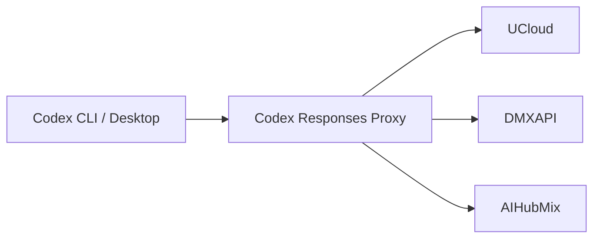

# Codex Responses Proxy

A local compatibility gateway for third-party OpenAI Responses APIs.

Licensed under [MIT](LICENSE). Forge coordinates and publication actors are
deployment context, not product identity.

It keeps Codex traffic provider-portable without editing conversation JSONL,
SQLite state, history, stored items, or model metadata.



## Product boundary

| Owner                 | Responsibility                                                                              |
| --------------------- | ------------------------------------------------------------------------------------------- |
| Codex                 | Conversations, tools, and per-conversation model selection                                  |
| Client control plane  | Credentials, provider selection, and client configuration                                   |
| Codex Responses Proxy | Responses normalization, replay portability, bounded recovery, and native service lifecycle |
| Provider              | Model execution, quotas, and upstream availability                                          |

The proxy does not configure or restart clients. A client control plane does
not manage the proxy process. Each product is installed and verified independently.

## Requirements

End users need only:

- the native release asset for their platform;
- the release trust anchor supplied by their organization;
- a third-party Responses endpoint configured by their client control plane.

Python, a source checkout, Git, and Forge credentials are not runtime
requirements.

## Install

```bash
codex-responses-proxy install \
  --asset "$HOME/Downloads/codex-responses-proxy-<version>-macos-arm64.tar.gz" \
  --trust-anchor ~/Downloads/codex-responses-proxy-allowed-signers
```

Replace `<version>` with the release version you downloaded. Download that
platform archive together with `SHA256SUMS` and `SHA256SUMS.sig` from either
official release plane. Keep the matching platform manifest—such as
`codex-responses-proxy-macos-arm64.manifest.json`—in the same directory.
`--asset` names the local archive. `--trust-anchor` names the SSH
`allowed_signers` file distributed by the organization or release owner through
a separate trusted channel. The installer requires the complete release set
and verifies the signed checksum before changing the service.

Use `--port` only when the default listener port `8792` conflicts with another
local service:

```bash
codex-responses-proxy install \
  --asset "$HOME/Downloads/codex-responses-proxy-<version>-macos-arm64.tar.gz" \
  --trust-anchor ~/Downloads/codex-responses-proxy-allowed-signers \
  --port 8801
```

Installation verifies the selected native bundle, commits it inside a rollback
transaction, and prewarms the exact installed executable before handoff. Use
`--timeout-seconds` only when a cold native executable needs more than the
default 30 seconds. Installation also projects `codex-responses-proxy` into the
current user's platform command directory as a native link. It does not create
a wrapper or edit a shell profile. The installed-state record retains that
exact path so status, rollback, and uninstall do not depend on a later shell's
environment. Installation never downloads dependencies or reads provider
credentials.

### Upgrade from 2.x

Release 2.0.58 coupled candidate prewarm to the retired public `version`
subcommand and therefore cannot drive an in-place upgrade to 3.x. For that one
historical boundary, extract the verified 3.x archive and invoke its bundled
`bin/codex-responses-proxy install` command with the same `--asset` and
`--trust-anchor` arguments. The candidate then owns the normal transactional
upgrade. Releases after 3.0.0 use a private, version-neutral prewarm protocol;
future public CLI changes do not alter it.

### Upgrade to 3.1.0

Release 3.1.0 introduces the retained-generation finalization required by the
new `rollback` command. An older installer cannot retroactively execute that
new finalization step. To establish the carrier once, extract the verified
3.1.0 archive and invoke its bundled `bin/codex-responses-proxy install`
command with the usual `--asset` and `--trust-anchor` arguments. After that
transition, the installed release again owns ordinary adjacent upgrades. No
legacy carrier is synthesized and no compatibility reader is retained.

## Configure a client route

The listener exposes one provider-scoped namespace per admitted provider:

| Provider | Responses base URL                  |
| -------- | ----------------------------------- |
| DMXAPI   | `http://127.0.0.1:8792/dmxapi/v1`   |
| UCloud   | `http://127.0.0.1:8792/ucloud/v1`   |
| AIHubMix | `http://127.0.0.1:8792/aihubmix/v1` |

Configure these URLs in the client control plane. For example:

```toml
[providers.dmxapi]
base_url = "http://127.0.0.1:8792/dmxapi/v1"

[providers.ucloud]
base_url = "http://127.0.0.1:8792/ucloud/v1"

[providers.aihubmix]
base_url = "http://127.0.0.1:8792/aihubmix/v1"
```

The table names are illustrative; use the client's native configuration
grammar. The proxy has no package or configuration dependency on that client.

## Operate

```bash
# Human-readable state
codex-responses-proxy status

# Stable machine contract
codex-responses-proxy status --json

# Read-only diagnosis
codex-responses-proxy doctor

# Transactional same-payload handoff
codex-responses-proxy reload

# Converge on the exact active release or verified retained predecessor
codex-responses-proxy rollback --to-release <exact-version>

# Resolve an interrupted install or upgrade; idle recovery is a successful no-op
codex-responses-proxy recover

# Remove native supervision; preserve the verified payload
codex-responses-proxy uninstall

# Remove supervision and manifest-owned payload files
codex-responses-proxy uninstall --purge
```

Lifecycle JSON uses one explicit `state` discriminator. `rollback` returns
`unchanged` when the requested release is already the proven active
installation, `unavailable` when no verified predecessor exists, and
`rolled_back` only after the requested predecessor is the proven accepting
installation. `recover` returns
`not_required` when no transaction exists, `closed` when an unmutated prepared
transaction is discarded, `finalized` when the committed candidate is already
the proven live installation, and `rolled_back` when the exact prior state is
restored. `uninstall` and `uninstall --purge` return `not_installed` with exit
status zero only when no owned service, listener, command, payload, or
transaction exists. Existing but unverifiable state is never treated as
absence and remains unchanged for diagnosis.

A successful upgrade retains exactly one predecessor in the immutable
generation store. One atomic selector under the stable control root is the
sole authority for both the active generation and that predecessor; installed
state and the user command remain stable control surfaces outside either
generation. The selector chooses the serving payload; the user command stays
on the newest verified selected release, so an explicit serving rollback cannot
downgrade `status`, `doctor`, `recover`, `rollback`, or the next installer.
Native supervision remains bound to the serving generation. Finalization is
idempotent across interruption, and the
transaction owns temporary bootstrap evidence, selector reconciliation,
cleanup, and recovery until it closes. `status` therefore reports rollback as
`deferred` while a transaction is active instead of treating its intermediate
state as an independent rollback authority. Explicit rollback drains the
current listener and replaces its native process generation before proving the
retained predecessor; the older release does not need to understand a newer
hot-handoff capability.

Expected failures are concise and actionable. Human mode does not emit a
traceback, warning dump, serialized object, credential, request body, or private
path. Automation should use `--json` where the command supports it.

## Compatibility behavior

Every request is projected to a provider-portable Responses grammar before it
leaves the loopback listener.

| Concern                     | Behavior                                                                                     |
| --------------------------- | -------------------------------------------------------------------------------------------- |
| Storage                     | Sends `store=false`; continuity comes from replayed dialogue and complete tool relationships |
| Provider IDs                | Removes response, conversation, cache, stored-item, and provider-issued item bindings        |
| Encrypted replay            | Removes unverifiable encrypted content without claiming decryption                           |
| Tool replay                 | Keeps complete function/custom-tool call pairs; rejects unsafe structure locally             |
| Empty upstream response     | Returns a retryable local `503` instead of committing false success                          |
| DMXAPI `477 empty_response` | Retries the already-projected bytes once                                                     |
| Upstream `429`              | Relays the first response and applies a provider-scoped bounded cooldown                     |
| `response_failed`           | Uses strictly shrinking, pair-safe recovery; one final dialogue-only attempt is bounded      |
| Invalid `input` union       | Uses one smaller current-dialogue fallback, then stops                                       |

The proxy never rewrites conversation storage to obtain portability.

## Request boundary

Only exact paths matching this grammar are admitted:

```text
/<provider>/v1/responses
```

Encoded path material, dot segments, duplicate separators, absolute targets,
fragments, and unrelated endpoints are rejected before remote I/O. Provider
origins come from the product manifest; headers, bodies, and query parameters
cannot select another host.

## Runtime evidence

`status --json` reports secret-free local evidence:

- installed release, payload integrity, and command discoverability;
- native service and exact listener identity;
- transaction state;
- accepting and draining state;
- bounded reliability counters and classified failures.

It does not report prompts, tokens, headers, request bodies, upstream payloads,
or conversation content.

## Troubleshooting

| Symptom                            | First action                                   | Interpretation                                                                |
| ---------------------------------- | ---------------------------------------------- | ----------------------------------------------------------------------------- |
| Replay or encrypted-item rejection | `codex-responses-proxy doctor`                 | Confirm local payload and listener integrity before changing the client route |
| Error after provider switch        | Check the client control plane                 | A direct provider URL bypasses proxy portability                              |
| Local `503`                        | `codex-responses-proxy status --json`          | Distinguish empty/truncated upstream output from local lifecycle failure      |
| Local or upstream `429`            | Inspect `Retry-After` and provider state       | Cooldown is provider-scoped; the proxy does not impose a global request queue |
| Route change not observed          | Reload the client through its normal lifecycle | The proxy does not restart or mutate clients                                  |

## Development

Development uses the repository-owned Python environments and locked supply
chain. These commands are DX, not product UX:

```bash
mise install --locked
mise exec --locked -- uv sync --locked --all-groups
mise exec --locked -- uv run --locked --no-sync nox -s full
mise exec --locked -- uv run --locked --no-sync nox -s release
```

`mise exec --locked --` selects the repository toolchain. uv owns this
worktree's `.venv`; Nox owns its isolated `.nox/<session>` verification
environments. Use `mise exec --locked -- uv run --locked --no-sync nox -s
quick` while editing. `full` is the non-redundant admission graph: repository
governance, strict quality and Python 3.12 coverage, then complete compatibility
runs on Python 3.13 and 3.14.

See [CONTRIBUTING](CONTRIBUTING.md) for source verification and release work.

## Documentation

| Need                     | Source of truth                                                        |
| ------------------------ | ---------------------------------------------------------------------- |
| Product and first use    | This README                                                            |
| Development workflow     | [CONTRIBUTING](CONTRIBUTING.md)                                        |
| Runtime architecture     | [Architecture](docs/architecture/authority-and-runtime-boundary.md)    |
| Release governance       | [Release policy](docs/governance/release-and-change-policy.md)         |
| Forge publication        | [Forge operations](docs/operations/forge-operations.md)                |
| Decision register        | [Decision Records](docs/decisions/decision-register.md)                |
| Durable product boundary | [DR-0001](docs/decisions/dr-0001-control-plane-data-plane-boundary.md) |
| Release history          | [CHANGELOG](CHANGELOG.md)                                              |

Licensed under the [MIT License](LICENSE).
