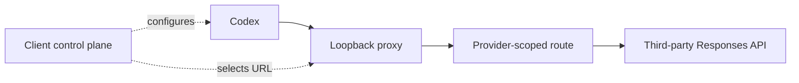
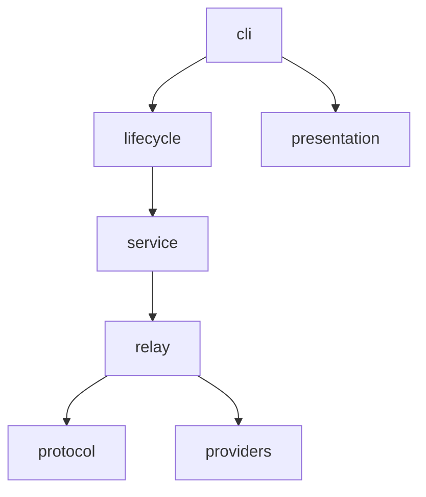
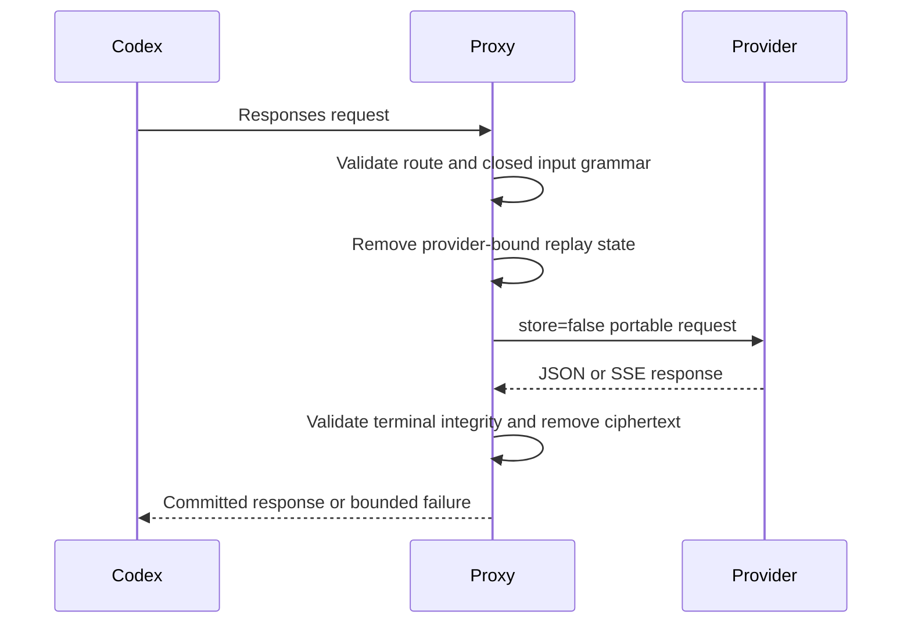
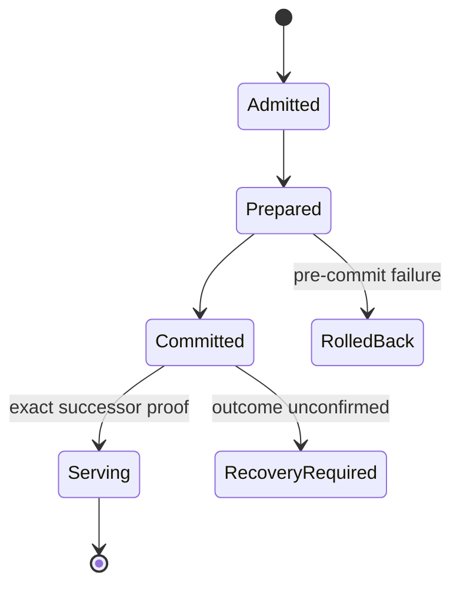

# Authority and Runtime Boundary

Codex Responses Proxy is a local Responses data plane. It normalizes outbound
traffic and owns its native service lifecycle. It does not own client state or
provider selection.

## Product graph



## Authority

| Owner | Authoritative state |
| --- | --- |
| Codex | Conversations, tool state, JSONL, SQLite, stored items, model metadata |
| Client control plane | Credentials, provider selection, and client endpoint configuration |
| Proxy source and release | Provider manifest, protocol policy, native executable, lifecycle contract |
| Installed proxy | Manifest-owned payload and native service projection |
| Provider | Model execution, quota, and upstream availability |
| GitLab / GitHub | Independent CI, tag, Release, and asset records |

The proxy repairs compatibility only at the network edge. It never rewrites a
conversation or reads another product's configuration.

## Semantic packages



| Package | Owns |
| --- | --- |
| `cli` | Public grammar, command composition, human/JSON selection |
| `providers` | Manifest-defined routes and optional pure policies |
| `protocol` | Closed provider-portable request and response grammar |
| `relay` | Admission, upstream exchange, retries, cooldown, SSE and HTTP integrity |
| `service` | Listener process, health, structured logs, control and handoff protocol |
| `lifecycle` | Artifact trust, payload transaction, supervision, install, reload, uninstall |

Dependencies point toward semantic owners. No package may infer provider
behavior from a name when the manifest or explicit policy contract owns it.

## Provider routing

The released manifest is the sole provider registry.

```text
/<provider>/v1/responses
/<provider>/v1/models
```

- Responses routes enter projection, recovery, cooldown, and integrity checks.
- Models routes are transparent authenticated GET relays.
- Unscoped, encoded, ambiguous, or unrelated paths fail before remote I/O.
- Headers, bodies, and query parameters cannot select an upstream host.
- Adding an ordinary provider changes one manifest table.

## Responses projection



The request projection removes response, conversation, cache, provider-issued
item, search, and encrypted-reasoning bindings. It retains portable dialogue
and complete tool relationships. Unknown or unsafe structures fail locally.

The response projection never claims that ciphertext was decrypted. Empty,
truncated, malformed, oversized, or non-terminal success bodies become a
retryable local `503`; partial success bytes are not committed.

## Recovery ownership

| Condition | Bounded behavior |
| --- | --- |
| DMXAPI `477 empty_response` | Retry the already-projected bytes once |
| `response_failed` | Strictly shrinking pair-safe attempts, then at most one dialogue-only attempt |
| Invalid `input` union | One smaller current-dialogue attempt |
| Pre-content stream interruption | Retry only before substantive downstream commitment |
| `429` | Relay once; provider-scoped cooldown; no global queue |

Each recovery consumes the same provider-portable request owner. No recovery
path restores provider IDs, ciphertext, or an older request body.

## Lifecycle transaction



Artifact admission verifies the release asset and external trust anchor. The
payload transaction owns exact files and receipts. Installation finalizes only
after one listener proves the expected release, payload digest, manifest digest,
receipt digest, PID, and accepting state.

Reload is same-payload handoff. Upgrade is install. Uninstall removes native
supervision first, proves owned listener exit, then optionally removes only
manifest-owned payload files.

## Human and machine surfaces

The CLI projects one result model:

| Surface | Contract |
| --- | --- |
| Human | Scannable lifecycle state and one safe next action |
| JSON | Stable, secret-free machine evidence |
| Logs | Structured bounded events; no prompts, Tokens, headers, bodies, or raw upstream payloads |

Runtime evidence proves only the installed listener. It does not prove client
configuration, provider billing, or recovery of a historical conversation.
