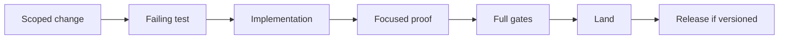
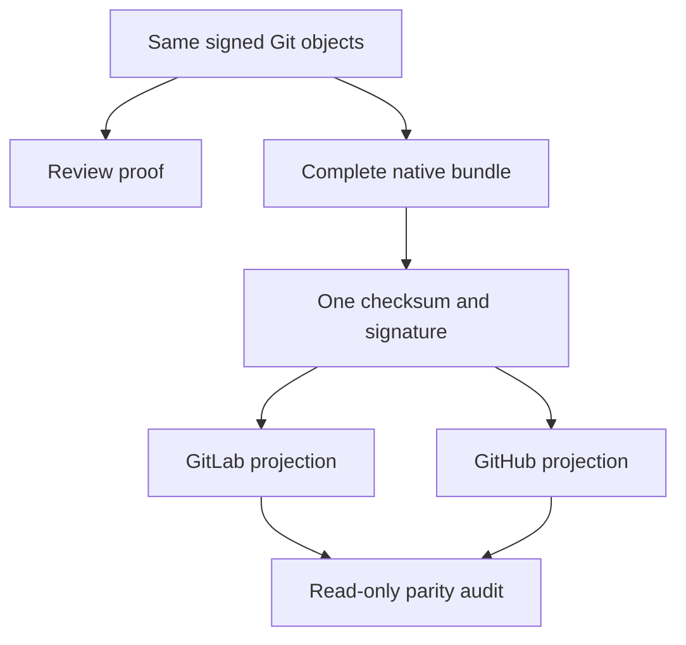

# Release and Change Policy

This document defines current invariants. Git, Forge records, the Changelog,
OpenSpec lifecycle records, and admitted evidence preserve history within their
own authority boundaries. Historical material does not become current product
authority merely because it remains retained.

## Authority

1. Current user instruction.
2. Source, tests, `VERSION`, CI, and release policy.
3. Current canonical documentation.
4. OpenSpec change records and evidence.
5. Installed projections and logs.

A current document must not carry a delivery-lane status or incident narrative.

## Branches

| Ref           | Local | Remote                     |
| ------------- | ----- | -------------------------- |
| `main`        | Yes   | Yes; protected default     |
| `dev`         | Yes   | Yes; protected integration |
| `proposal/*`  | Yes   | Yes                        |
| `candidate/*` | Yes   | No                         |
| `work/*`      | Yes   | No                         |

Pre-push rejects every remote branch outside the whitelist. Release tags are
local product objects published unchanged to either optional Forge.

## Change admission



- Use one active atomic OpenSpec change for material product work.
- Keep source, tests, docs, and specification synchronized.
- Complete and archive OpenSpec changes through the declared lifecycle after
  canonical specifications and durable decisions absorb their surviving
  semantics. Archived changes remain historical inputs, not mutation authority.
- A Change proves a releasable product increment; hosted publication and
  canonical installation consume the final archived source as release
  acceptance. They never become circular prerequisites for archiving the
  Change. A defect found by release acceptance starts a successor Change.
- Do not preserve aliases, facades, or compatibility residue without a current requirement.
- Do not write personal identity, local path, credential, key, fingerprint, or private Forge coordinate into product source.

## Decision records and names

- OpenSpec authorizes a bounded change; `docs/decisions/` preserves only its
  durable rationale. Do not duplicate specifications, task status, or incident
  narratives in a Decision Record.
- Project-owned Decision Records use
  `dr-<four-digit-sequence>-<concise-kebab-case-description>.md` and the matching
  `DR-<sequence>` title.
- Project-owned prose, scripts, modules, fixtures, and tests use concise names
  that identify their semantic owner and responsibility. Generic buckets such
  as `common`, `helpers`, `misc`, `shared`, or an unexplained bare sequence are
  invalid.
- Ecosystem protocol names remain unchanged: examples include `README.md`,
  `CHANGELOG.md`, `pyproject.toml`, `__init__.py`, and OpenSpec carrier names.
- A Decision Record is required for durable product boundaries, foundational
  architecture or dependency choices, compatibility and retention policy,
  release trust, security posture, or another costly-to-reverse ruling.

## Quality

Each tool-native configuration is the sole policy owner for its concern. Root
placement is preferred when the tool and IDEs discover that file natively;
`pytest.ini` therefore owns test discovery and warning policy. Explicitly
addressed reusable policies live under `.config/quality/policy/`. Nox executes
those owners, `.ethos/profile.toml` registers gates, and CI/hooks only project
them.

Required local evidence includes:

```bash
mise exec --locked -- uv run --locked --no-sync nox -s full
mise exec --locked -- uv run --locked --no-sync nox -s release
```

The explicit `mise exec --locked --` boundary makes the repository-selected
toolchain authoritative in interactive shells, agents, and other non-login
processes alike.

`quick` is optional feedback, not a second admission graph. `full` composes the
locked governance tools, strict Python 3.12 quality and coverage owner, and the
remaining Python compatibility runs without repeating equivalent work.

Statement and measured branch coverage must each be strictly above 95%.
Warnings are errors. Product and development dependencies come from this
repository's locked environment.

## Local-first closure

A clean accepted checkout can build, verify, install, exercise, and uninstall
the current-platform native product without either Forge. Local success does
not imply hosted publication.

## Independent Forge publication



GitLab and GitHub are optional, peer-local publication planes. They use separate
transport credentials, account verification, CI, and Release APIs while
observing the same commit and annotated tag objects.

Product construction is independent of Forge publication. The admitted native
builder for each platform creates that platform's asset pair. One product
assembler then verifies the complete inventory, creates `SHA256SUMS`, and signs
the resulting bundle once. GitLab and GitHub consume, verify, upload, and
re-download those exact bytes; neither Forge may build, subset, repackage, or
re-sign the bundle.

One peer may publish while the other is unavailable. That is one-sided
publication, not dual-Forge parity. Parity requires exact commit and tag objects,
equal complete inventories and bytes, and the same product trust-anchor digest.

## Release identity

`VERSION` owns the version. `CHANGELOG.md` records forward release history.
Failed tags and runs are retained; a repair uses a later version and never
rewrites published provenance.

Commit and tag identity is one protected product execution input. Each selected
Forge must accept its public key and verified email. Transport credentials and
Release API credentials remain provider-local and never alter Git objects.

## Installation

Installation consumes one verified native asset and one external trust anchor.
It has no GitLab, GitHub, CI, or source-checkout dependency.

The installer must:

1. verify asset identity and signature;
2. verify the complete candidate native bundle;
3. prepare an owned transaction and commit exact payload files;
4. prewarm the exact committed executable within the rollback domain;
5. bind native supervision to the committed executable;
6. prove one accepting native listener through transactional handoff;
7. finalize or retain an explicit recovery-required state.

Prewarm uses one private executable role owned by the product runtime. Public
CLI commands and options are not an installer-to-successor protocol. A
historical installer that predates this role is crossed once by invoking the
verified successor executable; it does not justify a public compatibility
alias or a second installer.

## Runtime operations

| Command             | Mutation              | Proof boundary                          |
| ------------------- | --------------------- | --------------------------------------- |
| `status`            | None                  | Installed payload and listener evidence |
| `doctor`            | None                  | Classified local lifecycle checks       |
| `reload`            | Same-payload handoff  | Exact successor identity                |
| `install`           | Payload replacement   | Verified asset and successor            |
| `rollback`          | Predecessor restore   | Selected retained generation            |
| `recover`           | Transaction resume    | Active transaction and runtime evidence |
| `uninstall`         | Service removal       | Exact owned process exit                |
| `uninstall --purge` | Owned payload removal | Valid manifest inventory                |

No lifecycle command edits a client or conversation.

## Provider changes

Provider work is admitted through the smallest semantic owner:

1. Prefer direct client-to-provider use when the protocol is already sound.
2. Add a manifest route when the existing portable Responses contract is
   sufficient.
3. Add provider policy only for a captured, reproducible wire incompatibility.
4. Treat new authentication or invocation protocols as explicit architecture
   changes rather than provider-name conditionals.

Every provider policy requires portable baseline tests, the minimal failing
fixture, a bounded behavior contract, and current runtime evidence. It must not
add client configuration, secret storage, implicit fallback, or conversation
state.

## Closeout

A delivery lane may be removed only after exact owner-bound closeout proves:

- clean worktree;
- integrated or tree-represented content;
- no active path user;
- no live lease;
- exact final head and branch identity.

A clean directory or idle process is not retirement authority.
