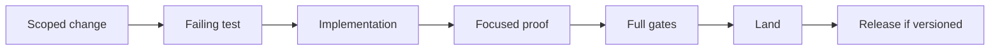
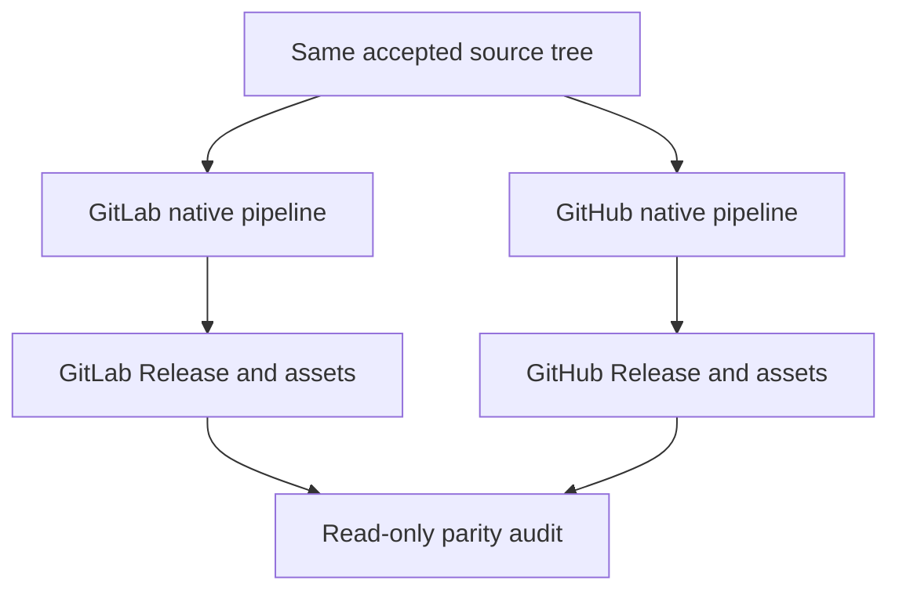

# Release and Change Policy

This document defines current invariants. Git, Forge records, the Changelog,
OpenSpec lifecycle records, and admitted evidence preserve history within their
own authority boundaries. Historical material does not become current product
authority merely because it remains retained.

## Authority

1. Current user instruction.
2. Source, tests, `VERSION`, CI, and release policy.
3. Current canonical documentation.
4. OpenSpec change records and evidence.
5. Installed projections and logs.

A current document must not carry a delivery-lane status or incident narrative.

## Branches

| Ref | Local | Remote |
| --- | --- | --- |
| `main` | Yes | Yes; protected default |
| `dev` | Yes | Yes; protected integration |
| `proposal/*` | Yes | Yes |
| `candidate/*` | Yes | No |
| `work/*` | Yes | No |

Pre-push rejects every remote branch outside the whitelist. Tags follow the
release policy and remain provider-native.

## Change admission



- Use one active atomic OpenSpec change for material product work.
- Keep source, tests, docs, and specification synchronized.
- Complete and archive OpenSpec changes through the declared lifecycle after
  canonical specifications and durable decisions absorb their surviving
  semantics. Archived changes remain historical inputs, not mutation authority.
- Do not preserve aliases, facades, or compatibility residue without a current requirement.
- Do not write personal identity, local path, credential, key, fingerprint, or private Forge coordinate into product source.

## Decision records and names

- OpenSpec authorizes a bounded change; `docs/decisions/` preserves only its
  durable rationale. Do not duplicate specifications, task status, or incident
  narratives in a Decision Record.
- Project-owned Decision Records use
  `dr-<four-digit-sequence>-<concise-kebab-case-description>.md` and the matching
  `DR-<sequence>` title.
- Project-owned prose, scripts, modules, fixtures, and tests use concise names
  that identify their semantic owner and responsibility. Generic buckets such
  as `common`, `helpers`, `misc`, `shared`, or an unexplained bare sequence are
  invalid.
- Ecosystem protocol names remain unchanged: examples include `README.md`,
  `CHANGELOG.md`, `pyproject.toml`, `__init__.py`, and OpenSpec carrier names.
- A Decision Record is required for durable product boundaries, foundational
  architecture or dependency choices, compatibility and retention policy,
  release trust, security posture, or another costly-to-reverse ruling.

## Quality

Required local evidence includes:

```bash
uv run --locked --no-sync nox -s quick
uv run --locked --no-sync nox -s quality
uv run --locked --no-sync nox -s tests-3.12 tests-3.13 tests-3.14
uv run --locked --no-sync nox -s release
```

Statement and measured branch coverage must each be strictly above 95%.
Warnings are errors. Product and development dependencies come from this
repository's locked environment.

## Local-first closure

A clean accepted checkout can build, verify, install, exercise, and uninstall
the current-platform native product without either Forge. Local success does
not imply hosted publication.

## Independent Forge publication



GitLab and GitHub:

- build their own assets;
- use their own credentials, actors, tags, trust anchors, CI, and Release API;
- never wait for, download from, authenticate to, or publish through the other;
- remain independently usable when the peer is unavailable.

Parity is a post-publication read-only claim. It compares version, source tree,
and common-platform payload digests; provider-native signatures remain distinct.

## Release identity

`VERSION` owns the version. `CHANGELOG.md` records forward release history.
Failed tags and runs are retained; a repair uses a later version and never
rewrites published provenance.

Commit and tag actors are protected execution inputs. Product source does not
bind an individual author, email, key, or fingerprint.

## Installation

Installation consumes one verified native asset and one external trust anchor.
It has no GitLab, GitHub, CI, or source-checkout dependency.

The installer must:

1. verify asset identity and signature;
2. prepare an owned transaction;
3. commit exact payload files;
4. prove one accepting native listener;
5. finalize or retain an explicit recovery-required state.

## Runtime operations

| Command | Mutation | Proof boundary |
| --- | --- | --- |
| `status` | None | Installed payload and listener evidence |
| `doctor` | None | Classified local lifecycle checks |
| `reload` | Same-payload handoff | Exact successor identity |
| `install` | Payload replacement | Verified asset and successor |
| `uninstall` | Service removal | Exact owned process exit |
| `uninstall --purge` | Owned payload removal | Valid manifest inventory |

No lifecycle command edits a client or conversation.

## Closeout

A delivery lane may be removed only after exact owner-bound closeout proves:

- clean worktree;
- integrated or tree-represented content;
- no active path user;
- no live lease;
- exact final head and branch identity.

A clean directory or idle process is not retirement authority.
