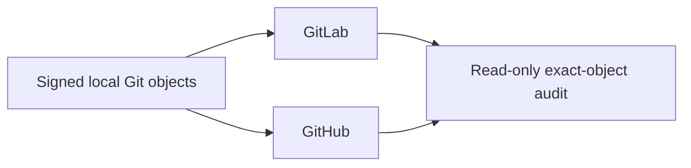

# Forge Operations

Local Git is the product-object authority. GitLab and GitHub are independent,
optional publication peers; neither is a mirror source for the other.

## Authority model



| Plane | Owns |
| --- | --- |
| Local | Commit and tag objects, build, test, package, install, runtime proof |
| GitLab | Transport authentication, account verification, CI, Release, assets |
| GitHub | Transport authentication, account verification, CI, Release, assets |
| Audit | Read-only comparison after publication |

The commit and annotated tag are signed once locally. The public signing key and
product email must be accepted by each selected Forge. SSH keys or tokens used to
push may differ per Forge; transport authentication never changes a Git object.

## Product publication context

The publication context is an explicit protected input, not repository source:

```toml
schema-version = 1

[product]
actor-name = "Product Publisher"
actor-email = "publisher@example.com"
active-signing-fingerprint = "SHA256:..."
```

Each Forge supplies its own allowed-signers trust input. Product source contains
no personal key, private credential, local checkout path, or Forge token.

## Branches

Publishing local `main` atomically advances the selected peer's protected `main`
and `dev` to the same commit. A `proposal/*` publication advances only that exact
proposal. `dev`, `candidate/*`, `work/*`, and arbitrary feature refs are not
publication sources.

```bash
uv run --locked --no-sync python -m tools.forge.project \
  --provider gitlab \
  --email "$PRODUCT_EMAIL" \
  --allowed-signers "$GITLAB_COMMIT_ALLOWED_SIGNERS" \
  --repository "$GITLAB_REPOSITORY" \
  --runner-tag "$GITLAB_RUNNER_TAG"

uv run --locked --no-sync python -m tools.forge.project \
  --provider github \
  --email "$PRODUCT_EMAIL" \
  --allowed-signers "$GITHUB_COMMIT_ALLOWED_SIGNERS" \
  --repository "$GITHUB_REPOSITORY"
```

Normal publication is fast-forward or idempotent. A one-time migration from an
old provider-specific history requires exact observed tips for every divergent
remote ref:

```bash
uv run --locked --no-sync python -m tools.forge.project \
  --provider <gitlab-or-github> \
  --email "$PRODUCT_EMAIL" \
  --allowed-signers <peer-commit-anchor> \
  --expect-remote-tip main=<observed-main-oid> \
  --expect-remote-tip dev=<observed-dev-oid>
```

The projector uses an atomic push and per-ref `--force-with-lease`. Any remote
drift rejects the whole operation. It never creates a commit, maps histories,
or reads the other peer.

## Tags and releases

The first invocation creates and signs the local annotated tag. Each invocation
then verifies and publishes that exact local tag object to one selected peer:

```bash
uv run --locked --no-sync python -m tools.release.tag \
  --provider gitlab --tag v<VERSION> \
  --publication-context "$PUBLICATION_CONTEXT" \
  --anchor "$GITLAB_TAG_ALLOWED_SIGNERS"

uv run --locked --no-sync python -m tools.release.tag \
  --provider github --tag v<VERSION> \
  --publication-context "$PUBLICATION_CONTEXT" \
  --anchor "$GITHUB_TAG_ALLOWED_SIGNERS"
```

An existing remote tag with the same OID is idempotent. A different OID fails
closed. Each Forge independently runs CI and publishes its own Release record
and assets; neither consumes the other.

## Read-only parity audit

```bash
uv run --locked --no-sync python -m tools.forge.audit \
  --commit-anchor "$PRODUCT_COMMIT_ALLOWED_SIGNERS" \
  --author-email "$PRODUCT_EMAIL" \
  --tag-anchor "$PRODUCT_TAG_ALLOWED_SIGNERS" \
  --json
```

| Compared | Required result |
| --- | --- |
| Local/GitLab/GitHub `main` and `dev` | One exact commit OID |
| Product commit | Expected email and trusted signature |
| Local/GitLab/GitHub tags | Same annotated tag names and object OIDs |
| Tag targets | Same peeled commit and tree OIDs |
| Tag signatures | Trusted against the supplied product anchor |
| Remote branches | Only `main`, `dev`, and transient `proposal/*` while active |

Equal trees, equal messages, or a shared history suffix do not establish parity.

## Runners

A runner belongs to one `Forge × repository × platform × executor × purpose`
boundary. Tags describe capability, jobs prove the actual platform, and release
privileges remain separate from ordinary verification. Missing runner capacity
is an infrastructure fact, never permission to weaken product gates.
