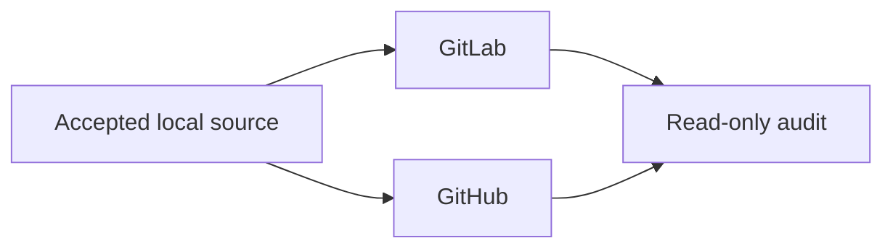

# Forge Operations

GitLab and GitHub are independent publication planes for one product source
tree. Neither is a mirror service for the other.

## Model



| Plane | Owns |
| --- | --- |
| Local | Accepted source, build, test, installation, runtime proof |
| GitLab | Provider-specific commit identities, CI, signed tag, Release, assets |
| GitHub | Provider-specific commit identities, CI, signed tag, Release, assets |
| Audit | Read-only comparison after both publications exist |

## Execution inputs

Publication context is external and protected. It may admit multiple authorized
actors and signers for team operation.

```toml
schema_version = 1
provider = "gitlab-or-github"
repository = "group-or-owner/repository"
commit_allowed_signers = "/protected/path"
tag_allowed_signers = "/protected/path"
```

The command plane consumes, among other protected values:

- `CODEX_RESPONSES_PROXY_GITLAB_COMMIT_ALLOWED_SIGNERS`;
- `CODEX_RESPONSES_PROXY_GITHUB_COMMIT_ALLOWED_SIGNERS`;
- `CODEX_RESPONSES_PROXY_RELEASE_ASSET_SIGNING_KEY`, a protected Forge secret;
- `CODEX_RESPONSES_PROXY_RELEASE_ASSET_TRUST`, the matching allowed-signers
  entry.

The GitLab file variable supplies its protected file path directly. The fixed
Ubuntu GitHub release job materializes its text secret once with mode `0600`.
Both adapters then supply the same file-path contract to release tooling.
Product code never accepts private-key text, recreates permissions, or writes a
second copy.

Product source contains no actor email, personal key, fingerprint, token, or
local checkout path.

## Branch publication

```bash
uv run --locked --no-sync python -m tools.forge.project \
  --provider gitlab --publication-context "$PUBLICATION_CONTEXT" \
  --anchor "$GITLAB_COMMIT_ANCHOR" --repository "$GITLAB_REPOSITORY" \
  --runner-tag "$GITLAB_RUNNER_TAG"
uv run --locked --no-sync python -m tools.forge.project \
  --provider github --publication-context "$PUBLICATION_CONTEXT" \
  --anchor "$GITHUB_COMMIT_ANCHOR" --repository "$GITHUB_REPOSITORY"
```

Each projection:

1. reads the selected provider context;
2. verifies source and provider-native history;
3. creates only the required provider-specific commit identities;
4. proves the update is forward-only and fast-forward;
5. atomically advances that Forge's protected `main` and `dev` to the same
   provider-native commit;
6. pushes no other branch.

`main` is the default release branch. `dev` is the shared integration branch.
They intentionally point to the same provider-native commit immediately after
publication; later proposal integration may advance `dev` first. Local
`candidate/dev` and `work/*` refs are never published.

No history rewrite, force push, tag copy, or cross-Forge credential use is
admitted.

## Tags and releases

```bash
uv run --locked --no-sync python -m tools.release.tag --provider gitlab --tag v<VERSION> \
  --publication-context "$PUBLICATION_CONTEXT" --anchor "$GITLAB_TAG_ANCHOR"
uv run --locked --no-sync python -m tools.release.tag --provider github --tag v<VERSION> \
  --publication-context "$PUBLICATION_CONTEXT" --anchor "$GITHUB_TAG_ANCHOR"
```

Each Forge builds and publishes its own assets. A GitLab job does not query or
download a GitHub release; a GitHub job does not query or download a GitLab
release.

A failed release remains immutable evidence. Repair by advancing `VERSION`,
Changelog, source, tag, and Release.

## Read-only parity audit

Refresh the required tracking refs, then run:

```bash
python3 tools/forge/audit.py \
  --tag "v$(cat VERSION)" \
  --gitlab-remote "$GITLAB_REMOTE" \
  --gitlab-api-base "$GITLAB_API_BASE" \
  --gitlab-repo "$GITLAB_REPOSITORY" \
  --github-remote "$GITHUB_REMOTE" \
  --github-repo "$GITHUB_REPOSITORY" \
  --gitlab-anchor "$GITLAB_ANCHOR" \
  --github-anchor "$GITHUB_ANCHOR" \
  --policy "$PUBLICATION_JOB_POLICY" \
  --json
```

The audit proves only the facts it observes. It does not authorize installation
or repair an incomplete release.

| Compared | Rule |
| --- | --- |
| Version and tag target | Same accepted product version and equal source tree |
| Required CI | Each provider's own required jobs succeed |
| Release record | Each provider has its own formal Release |
| Common platform assets | Archive and manifest payload digests match |
| Signatures | Verified independently; byte equality is not required |
| Platform-only assets | Valid on the publishing Forge; no false full-set equality |

## Runners

A runner belongs to one `Forge × repository × platform × executor × purpose`
boundary.

- Description identifies project, host platform, executor, and purpose.
- Tags express target capability, not a fictitious host identity.
- Every job proves actual OS and architecture before building.
- Verification and release privileges remain separate.
- A runner for one repository or Forge never serves the other implicitly.

Missing or mismatched runner capability blocks the job; it is not an allowed
failure and must not be disguised by platform monkeypatching.
