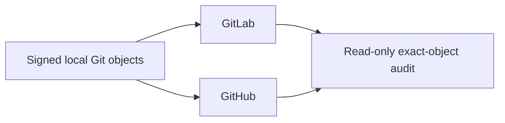

# Forge Operations

Local Git is the product-object authority. GitLab and GitHub are independent,
optional publication peers; neither is a mirror source for the other.

## Authority model



| Plane             | Owns                                                                                 |
| ----------------- | ------------------------------------------------------------------------------------ |
| Local             | Commit and tag objects, source proof, install, runtime proof                         |
| Native builders   | One admitted asset pair for each supported platform                                  |
| Product assembler | Complete platform inventory, one checksum manifest, one product signature            |
| GitLab            | Peer-local review and tag verification, transport authentication, Release projection |
| GitHub            | Peer-local review and tag verification, transport authentication, Release projection |
| Audit             | Read-only comparison after publication                                               |

The commit and annotated tag are signed once locally. The public signing key and
product email must be accepted by each selected Forge. SSH keys or tokens used to
push may differ per Forge; transport authentication never changes a Git object.

## Product publication context

The publication context is an explicit protected input, not repository source:

```toml
schema-version = 1

[product]
actor-name = "Product Publisher"
actor-email = "publisher@example.com"
active-signing-fingerprint = "SHA256:..."
```

Each Forge supplies its own allowed-signers trust input. Product source contains
no personal key, private credential, local checkout path, or Forge token.

## Branches

Publishing local `main` atomically advances the selected peer's protected `main`
and `dev` to the same commit. A `proposal/*` publication advances only that exact
proposal. `dev`, `candidate/*`, `work/*`, and arbitrary feature refs are not
publication sources.

```bash
uv run --locked --no-sync python -m tools.forge.project \
  --provider gitlab \
  --email "$PRODUCT_EMAIL" \
  --allowed-signers "$GITLAB_COMMIT_ALLOWED_SIGNERS" \
  --repository "$GITLAB_REPOSITORY" \
  --runner-tag "$GITLAB_RUNNER_TAG"

uv run --locked --no-sync python -m tools.forge.project \
  --provider github \
  --email "$PRODUCT_EMAIL" \
  --allowed-signers "$GITHUB_COMMIT_ALLOWED_SIGNERS" \
  --repository "$GITHUB_REPOSITORY"
```

Normal publication is fast-forward or idempotent. A one-time migration from an
old provider-specific history requires exact observed tips for every divergent
remote ref:

```bash
uv run --locked --no-sync python -m tools.forge.project \
  --provider <gitlab-or-github> \
  --email "$PRODUCT_EMAIL" \
  --allowed-signers <peer-commit-anchor> \
  --expect-remote-tip main=<observed-main-oid> \
  --expect-remote-tip dev=<observed-dev-oid>
```

The projector uses an atomic push and per-ref `--force-with-lease`. Any remote
drift rejects the whole operation. It never creates a commit, maps histories,
or reads the other peer.

## Tags and releases

The first invocation creates and signs the local annotated tag. Each invocation
then verifies and publishes that exact local tag object to one selected peer:

```bash
uv run --locked --no-sync python -m tools.release.tag \
  --provider gitlab --tag v<VERSION> \
  --publication-context "$PUBLICATION_CONTEXT" \
  --anchor "$GITLAB_TAG_ALLOWED_SIGNERS"

uv run --locked --no-sync python -m tools.release.tag \
  --provider github --tag v<VERSION> \
  --publication-context "$PUBLICATION_CONTEXT" \
  --anchor "$GITHUB_TAG_ALLOWED_SIGNERS"
```

An existing remote tag with the same OID is idempotent. A different OID fails
closed. Current runner placement may make one Forge the physical execution host
for some native builds, but it does not make that Forge a product authority.
Publication is a separate product operation, not a second provider-specific
workflow. A publisher accepts only the complete pre-signed bundle and cannot
build assets or regenerate its checksum inventory or signature.

The read-only dual-Forge verifier accepts explicit `--gitlab-git-url` and
`--github-git-url` values. These are fetchable Git URLs, not checkout-local
remote names: verification runs in an isolated bare repository that deliberately
does not inherit the caller's remote configuration. Both peers must be verified
against the same product trust anchor bytes; provider-specific account email or
transport credentials do not create different release identities.

Example:

```bash
uv run --locked --no-sync python -m tools.release.verify \
  --tag "v$VERSION" \
  --gitlab-git-url "$GITLAB_GIT_URL" \
  --gitlab-api-base "$GITLAB_API_BASE" \
  --gitlab-repo "$GITLAB_REPOSITORY" \
  --github-git-url "$GITHUB_GIT_URL" \
  --github-repo "$GITHUB_REPOSITORY" \
  --gitlab-anchor "$PRODUCT_TAG_ALLOWED_SIGNERS" \
  --github-anchor "$PRODUCT_TAG_ALLOWED_SIGNERS" \
  --json
```

The command emits stable provider-scoped reasons such as
`gitlab.remote_git_evidence_invalid` and `github.hosted_evidence_invalid`
without exposing a credential or transport error body.

Publish the same bundle to both peers with the single composition root:

```bash
uv run --locked --no-sync python -m tools.release.publish both \
  --github-repository "$GITHUB_REPOSITORY" \
  --gitlab-api-base "$GITLAB_API_BASE" \
  --gitlab-project-id "$GITLAB_PROJECT_ID" \
  --tag "v$VERSION" \
  --commit-oid "$RELEASE_COMMIT_OID" \
  --assets "$RELEASE_BUNDLE" \
  --workspace "$RELEASE_WORKSPACE" \
  --gitlab-credential-kind job-token
```

`CODEX_RESPONSES_PROXY_GITHUB_TAG_TRUST` and `RELEASE_ASSET_TRUST` are protected
execution inputs. `--gitlab-credential-kind job-token` reads `CI_JOB_TOKEN` and
sends `JOB-TOKEN`; `--gitlab-credential-kind private-token` reads
`CODEX_RESPONSES_PROXY_GITLAB_PRIVATE_TOKEN` and sends `PRIVATE-TOKEN`. The
selected kind never falls through to the other variable or header. The command attempts both peers,
reports every failure, and returns nonzero unless both provider-local
publications complete. The provider-specific subcommands support an explicitly
one-sided topology; neither result alone is dual-Forge parity.

## Historical macOS override records

Current native lifecycle acceptance snapshots the exact registered labels,
launchd override entries, and plist hashes before and after successful and
interrupted isolated installations. Equality proves that current lifecycle code
does not add host residue and that the canonical service remains unchanged.

Older versions may have left enabled override records for already-absent,
suffix-qualified test services. The public `launchctl` interface can list these
persisted overrides but does not provide an exact-label removal operation.
Ordinary uninstall therefore does not guess, prefix-match, or edit launchd's
root-owned private database. Historical override removal is explicit host
maintenance: an administrator must review the exact label list, prove that each
label has no registration, plist, or owned process, preserve the canonical
label, and verify the complete before/after projection. This maintenance does
not add compatibility logic to the product.

## Read-only parity audit

```bash
uv run --locked --no-sync python -m tools.forge.audit \
  --commit-anchor "$PRODUCT_COMMIT_ALLOWED_SIGNERS" \
  --author-email "$PRODUCT_EMAIL" \
  --tag-anchor "$PRODUCT_TAG_ALLOWED_SIGNERS" \
  --json
```

| Compared                             | Required result                                                      |
| ------------------------------------ | -------------------------------------------------------------------- |
| Local/GitLab/GitHub `main` and `dev` | One exact commit OID                                                 |
| Product commit                       | Expected email and trusted signature                                 |
| Local/GitLab/GitHub tags             | Same annotated tag names and object OIDs                             |
| Tag targets                          | Same peeled commit and tree OIDs                                     |
| Tag signatures                       | Trusted against the supplied product anchor                          |
| Remote branches                      | Only `main`, `dev`, and transient `proposal/*` while active          |
| Release inventory                    | Every platform from the product SSOT plus one checksum and signature |
| Release bytes                        | Exact equality for every asset and one trust-anchor digest           |

Equal trees, equal messages, or a shared history suffix do not establish parity.

## Runners

A runner belongs to one `Forge × repository × platform × executor × purpose`
boundary. Tags describe capability, jobs prove the actual platform, and release
privileges remain separate from ordinary verification. Missing runner capacity
is an infrastructure fact, never permission to weaken product gates.
