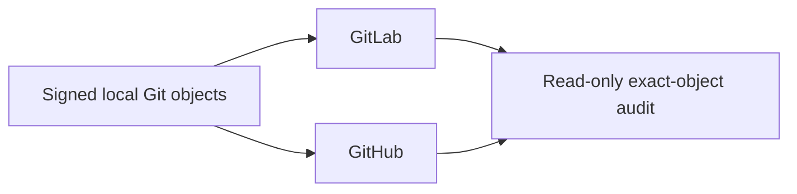

# Forge Operations

Local Git is the product-object authority. GitLab and GitHub are independent,
optional publication peers; neither is a mirror source for the other.

## Authority model


```mermaid
flowchart LR
    L["Signed local Git objects"] --> GL["GitLab"]
    L --> GH["GitHub"]
    GL --> A["Read-only exact-object audit"]
    GH --> A
```

| Plane             | Owns                                                                                 |
| ----------------- | ------------------------------------------------------------------------------------ |
| Local             | Commit and tag objects, source proof, install, runtime proof                         |
| Native builders   | One admitted asset pair for each supported platform                                  |
| Product assembler | Complete platform inventory, one checksum manifest, one product signature            |
| GitLab            | Peer-local review and tag verification, transport authentication, Release projection |
| GitHub            | Peer-local review and tag verification, transport authentication, Release projection |
| Audit             | Read-only comparison after publication                                               |

The commit and annotated tag are signed once locally. The public signing key and
product email must be accepted by each selected Forge. SSH keys or tokens used to
push may differ per Forge; transport authentication never changes a Git object.

## Product publication context

The publication context is an explicit protected input, not repository source:

```toml
schema-version = 1

[product]
actor-name = "Product Publisher"
actor-email = "publisher@example.com"
active-signing-fingerprint = "SHA256:..."
```

Each Forge supplies its own allowed-signers trust input. Product source contains
no personal key, private credential, local checkout path, or Forge token.

## Branches

Publishing local `main` atomically advances the selected peer's protected `main`
and `dev` to the same commit. A `proposal/*` publication advances only that exact
proposal. `dev`, `candidate/*`, `work/*`, and arbitrary feature refs are not
publication sources.

```bash
mise exec --locked -- uv run --locked --group quality python -m tools.forge.project \
  --provider gitlab \
  --email "$PRODUCT_EMAIL" \
  --allowed-signers "$GITLAB_COMMIT_ALLOWED_SIGNERS" \
  --repository "$GITLAB_REPOSITORY" \
  --runner-tag "$GITLAB_RUNNER_TAG"

mise exec --locked -- uv run --locked --group quality python -m tools.forge.project \
  --provider github \
  --email "$PRODUCT_EMAIL" \
  --allowed-signers "$GITHUB_COMMIT_ALLOWED_SIGNERS" \
  --repository "$GITHUB_REPOSITORY"
```

Normal publication is fast-forward or idempotent. A one-time migration from an
old provider-specific history requires exact observed tips for every divergent
remote ref:

```bash
mise exec --locked -- uv run --locked --group quality python -m tools.forge.project \
  --provider <gitlab-or-github> \
  --email "$PRODUCT_EMAIL" \
  --allowed-signers <peer-commit-anchor> \
  --expect-remote-tip main=<observed-main-oid> \
  --expect-remote-tip dev=<observed-dev-oid>
```

The projector uses an atomic push and per-ref `--force-with-lease`. Any remote
drift rejects the whole operation. It never creates a commit, maps histories,
or reads the other peer.

## Tags and releases

The first invocation creates and signs the local annotated tag. Each invocation
then verifies and publishes that exact local tag object to one selected peer:

```bash
mise exec --locked -- uv run --locked --group quality python -m tools.release.tag \
  --provider gitlab --tag v<VERSION> \
  --publication-context "$PUBLICATION_CONTEXT" \
  --anchor "$GITLAB_TAG_ALLOWED_SIGNERS"

mise exec --locked -- uv run --locked --group quality python -m tools.release.tag \
  --provider github --tag v<VERSION> \
  --publication-context "$PUBLICATION_CONTEXT" \
  --anchor "$GITHUB_TAG_ALLOWED_SIGNERS"
```

An existing remote tag with the same OID is idempotent. A different OID fails
closed. Current runner placement may make one Forge the physical execution host
for some native builds, but it does not make that Forge a product authority.
Publication is a separate product operation, not a second provider-specific
workflow. A publisher accepts only the complete pre-signed bundle and cannot
build assets or regenerate its checksum inventory or signature.

### Publication ownership

[`tools/release/publication`](../../tools/release/publication/) owns the command
tree for publishing, verification, and published-predecessor discovery. Each
Forge has its own semantic subpackage: `publish` owns remote release writes;
`observe` owns read-only hosted identity and CI evidence. The verifier composes
those observations without granting installation authority.

[`tools/forge`](../../tools/forge/) owns Git-reference projection, tag trust,
repository settings, and runner admission. Release construction and signing
remain under [`tools/release`](../../tools/release/); publishers only consume
the resulting immutable bundle. These are different responsibilities, not
alternative publication implementations.

Publication success covers both the verified bundle and its user-facing Release
links. GitLab publication compares every link's name, URL, and type with the
requested bundle, independent of ordering and server-assigned fields. It reads
the persisted Release after asset verification and creation or a concurrent
creation conflict; a POST acknowledgement alone is not publication evidence.
An existing mismatched Release fails without rewriting its metadata.

The read-only dual-Forge verifier accepts explicit `--gitlab-git-url` and
`--github-git-url` values. These are fetchable Git URLs, not checkout-local
remote names: verification runs in an isolated bare repository that deliberately
does not inherit the caller's remote configuration. Both peers must be verified
against the same product trust anchor bytes; provider-specific account email or
transport credentials do not create different release identities.

Example:

```bash
mise exec --locked -- uv run --locked --group quality python -m tools.release.publication verify \
  --tag "v$VERSION" \
  --gitlab-git-url "$GITLAB_GIT_URL" \
  --gitlab-api-base "$GITLAB_API_BASE" \
  --gitlab-repo "$GITLAB_REPOSITORY" \
  --github-git-url "$GITHUB_GIT_URL" \
  --github-repo "$GITHUB_REPOSITORY" \
  --gitlab-anchor "$PRODUCT_TAG_ALLOWED_SIGNERS" \
  --github-anchor "$PRODUCT_TAG_ALLOWED_SIGNERS" \
  --json
```

The command emits stable provider-scoped reasons such as
`gitlab.remote_git_evidence_invalid` and `github.hosted_evidence_invalid`
without exposing a credential or transport error body.

Publish the same bundle to both peers with the single composition root:

```bash
mise exec --locked -- uv run --locked --group quality python -m tools.release.publication both \
  --github-repository "$GITHUB_REPOSITORY" \
  --gitlab-api-base "$GITLAB_API_BASE" \
  --gitlab-project-id "$GITLAB_PROJECT_ID" \
  --tag "v$VERSION" \
  --commit-oid "$RELEASE_COMMIT_OID" \
  --assets "$RELEASE_BUNDLE" \
  --workspace "$RELEASE_WORKSPACE" \
  --gitlab-credential-kind job-token
```

`CODEX_RESPONSES_PROXY_GITHUB_TAG_TRUST` and `RELEASE_ASSET_TRUST` are protected
execution inputs. `--gitlab-credential-kind job-token` reads `CI_JOB_TOKEN` and
sends `JOB-TOKEN`; `--gitlab-credential-kind private-token` reads
`CODEX_RESPONSES_PROXY_GITLAB_PRIVATE_TOKEN` and sends `PRIVATE-TOKEN`. The
selected kind never falls through to the other variable or header. The command attempts both peers,
reports every failure, and returns nonzero unless both provider-local
publications complete. The provider-specific subcommands support an explicitly
one-sided topology; neither result alone is dual-Forge parity.

## Historical macOS override records

Current supervision uses the native user Background domain. Native qualification
records user-domain and associated GUI-domain registrations separately, along
with their disabled-state overrides and product plist hashes. A GUI-only
published predecessor must still be tested in its supported login context;
headless current-artifact success is different evidence. Neither qualification
nor ordinary installation creates a login session or borrows a protected user.

If a launch-agent file becomes malformed, unowned or indirect, preserve it and
inspect the exact file before repair. The product refuses to follow a symbolic
link, replace unrelated content or remove a carrier changed during teardown.
Only the verified installation's native watchdog declaration is mutation input.

Current native lifecycle acceptance snapshots the exact registered labels,
launchd override entries, and plist hashes before and after successful and
interrupted isolated installations. Equality proves that current lifecycle code
does not add host residue and that the canonical service remains unchanged.

Older versions may have left enabled override records for already-absent,
suffix-qualified test services. The public `launchctl` interface can list these
persisted overrides but does not provide an exact-label removal operation.
Ordinary uninstall therefore does not guess, prefix-match, or edit launchd's
root-owned private database. Historical override removal is explicit host
maintenance: an administrator must review the exact label list, prove that each
label has no registration, plist, or owned process, preserve the canonical
label, and verify the complete before/after projection. This maintenance does
not add compatibility logic to the product.

## Read-only parity audit

```bash
mise exec --locked -- uv run --locked --group quality python -m tools.forge.audit \
  --commit-anchor "$PRODUCT_COMMIT_ALLOWED_SIGNERS" \
  --author-email "$PRODUCT_EMAIL" \
  --tag-anchor "$PRODUCT_TAG_ALLOWED_SIGNERS" \
  --peer origin --peer github \
  --json
```

Each `--peer` names one configured Git remote, not a Forge type. Supply one
peer for single-Forge delivery or omit the option for local-only verification;
unselected peers are not contacted. Persistent branch roles come from
`.ethos/workspace.toml`, not hard-coded branch names.

| Compared          | Required result                                        |
| ----------------- | ------------------------------------------------------ |
| Persistent refs   | One exact commit OID locally and on selected peers     |
| Product commit    | Expected email and trusted signature                   |
| Release tags      | Same annotated tag names and object OIDs               |
| Tag targets       | Same peeled commit and tree OIDs                       |
| Tag signatures    | Trusted against the supplied product anchor            |
| Residual branches | None outside the declared persistent roles at closeout |

Equal trees, equal messages, or a shared history suffix do not establish parity.
An active work or proposal branch remains visible as unfinished housekeeping;
the audit never deletes it. Forge Release records, platform assets and their
downloaded bytes are separate publication-verification responsibilities, not
claims made by this Git-object audit.

## Runners

A runner belongs to one `Forge × repository × platform × executor × purpose`
boundary. Tags describe capability, jobs prove the actual platform, and release
privileges remain separate from ordinary verification. Missing runner capacity
is an infrastructure fact, never permission to weaken product gates.

The CUE model assigns Linux merge-request work to
`CODEX_RESPONSES_PROXY_GITLAB_LINUX_REVIEW_RUNNER_TAG` and accepted `dev`,
promotion, and tag checks to `CODEX_RESPONSES_PROXY_GITLAB_LINUX_RUNNER_TAG`.
These variables must identify different project-locked, tagged-only Runners.
The latter requires GitLab's `ref_protected` access. Linux review and protected jobs share one CUE-owned body and reference their
native scheduling variable directly. There is no intermediate workflow or
job-rule tag alias: GitLab does not recursively resolve those aliases before
Runner assignment. Runner-native access restrictions enforce
the boundary even when a proposal changes its YAML. Only protected tag checks
receive `CODEX_RESPONSES_PROXY_GITLAB_TAG_TRUST`; review jobs receive no release
signing key or publication credential.

macOS and Windows use `verify-macos-native` and `verify-windows-native` on
protected `dev`; their `-review` jobs run only for merge requests to `dev`.
The existing platform Runner-tag variables and their `_REVIEW` variants must
select separate accounts, workspaces, caches, and credential reachability.
Each job runs the locked release interpreter and uv, builds one candidate,
and executes `nox -s release_compatibility`. This session checks the packaged
commands, loopback traffic, fresh install, reload, recovery, cleanup, and
upgrade and rollback from a real signed predecessor. It does not repeat the
platform-independent Python compatibility or full quality matrix.

Before scheduling either native job, its account must have an immutable,
read-only predecessor asset set from this project's published GitLab Release:
the exact platform archive, platform manifest, `SHA256SUMS`, and
`SHA256SUMS.sig`. The public trust anchor lives outside the checkout. Supply
absolute destination-local paths through
`CODEX_RESPONSES_PROXY_GITLAB_MACOS_PREVIOUS_RELEASE_ASSET` or
`CODEX_RESPONSES_PROXY_GITLAB_WINDOWS_PREVIOUS_RELEASE_ASSET`, and
`CODEX_RESPONSES_PROXY_GITLAB_RELEASE_ASSET_TRUST_ANCHOR`. Resolve them on the
Runner; no workstation path belongs in source. Missing inputs fail before
the candidate is built. Both review and protected accounts may read these
public verification inputs; neither may alter the immutable supply.

Darwin ARM64 runs the locked ARM64 Python and uv. Windows ARM64 must invoke an
x64 Mise executable so native lock selection resolves the declared
`windows-x64` assets. Mise derives architecture from its executable, not from
the Python selected afterward. It then runs the locked x64 Python and uv under
emulation and exercises a Windows x64
candidate. Record host architecture and process architecture separately:
the physical CPU observation does not determine the executable ABI. The
interpreter must report `win-amd64`; native payload identity follows that ABI.
Complete lifecycle execution may qualify the Windows x64 asset under emulation,
never a native ARM64 asset. Native pytest sessions own a short, unique temporary
root outside the checkout so deep Runner paths do not exhaust Windows path
capacity. `TMPDIR`, `TEMP`, and `TMP` point to that same root, not Nox's
checkout-local build directory. The Runner owner must configure a short,
account-isolated native temporary parent in its deployment environment. No
private host path belongs in repository source. The test root is removed after
process teardown, including test failure.
The supported release inventory remains authoritative. A Linux container has
no systemd user manager and proves only its declared source checks; native
Linux service acceptance still requires a separate real user-service context.
Native jobs have a 20-minute deadline. Their lifecycle fixtures remove owned
services, listeners, payloads, and transactions and verify that unrelated
canonical resources remain unchanged.
