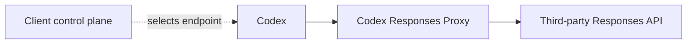
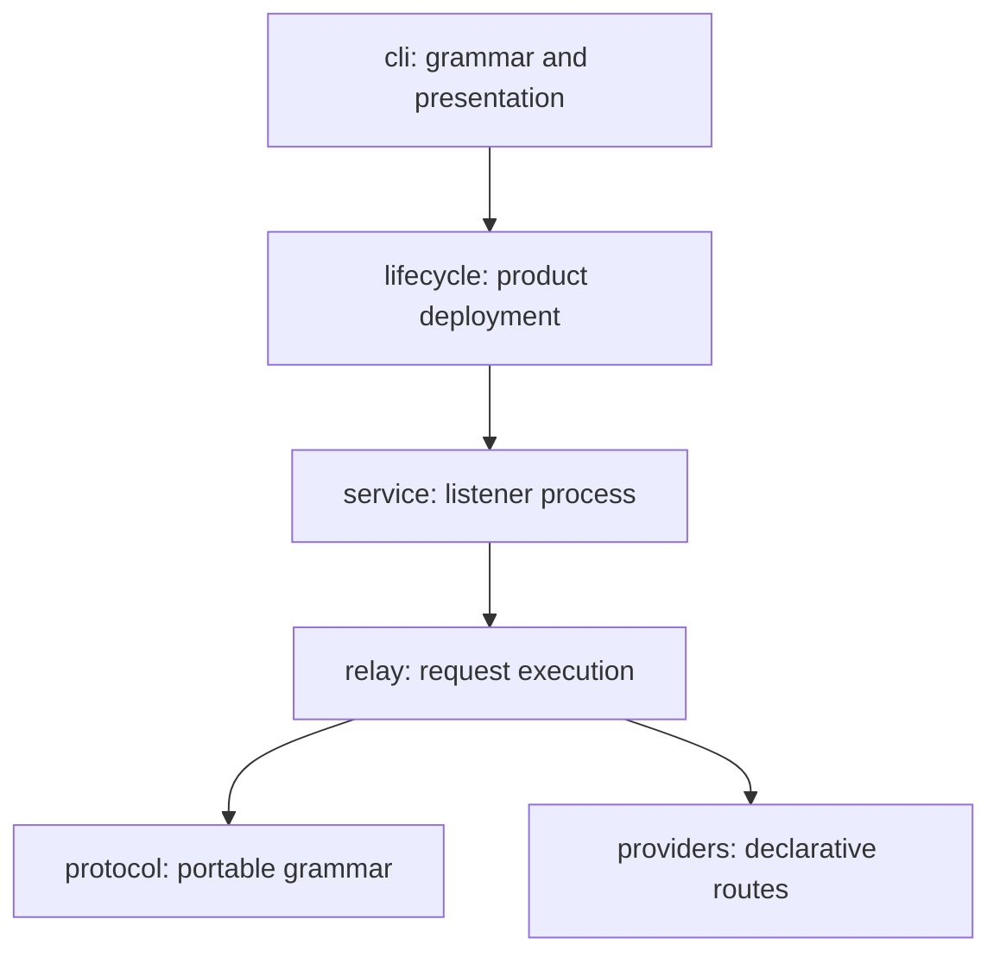
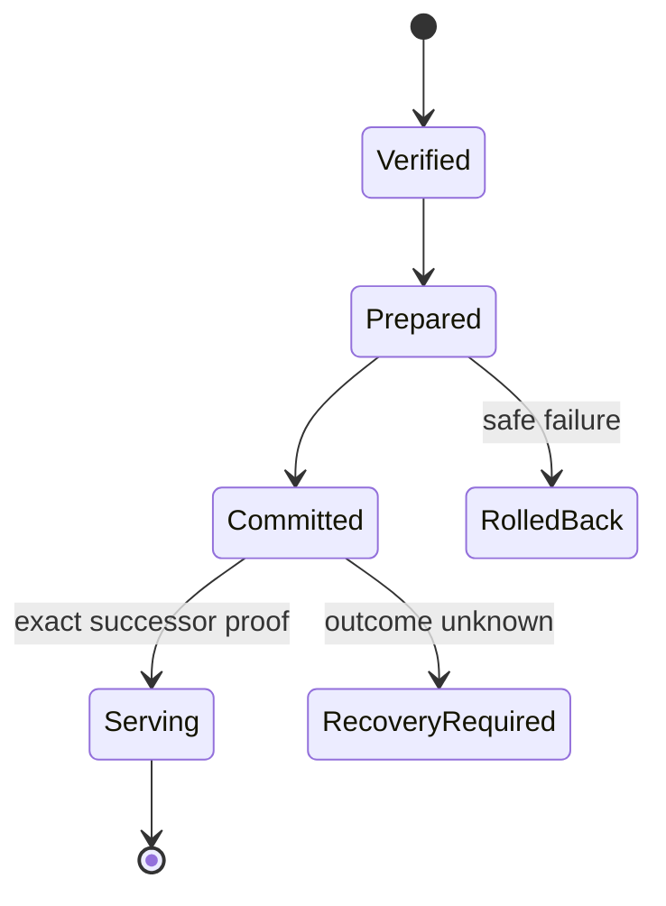
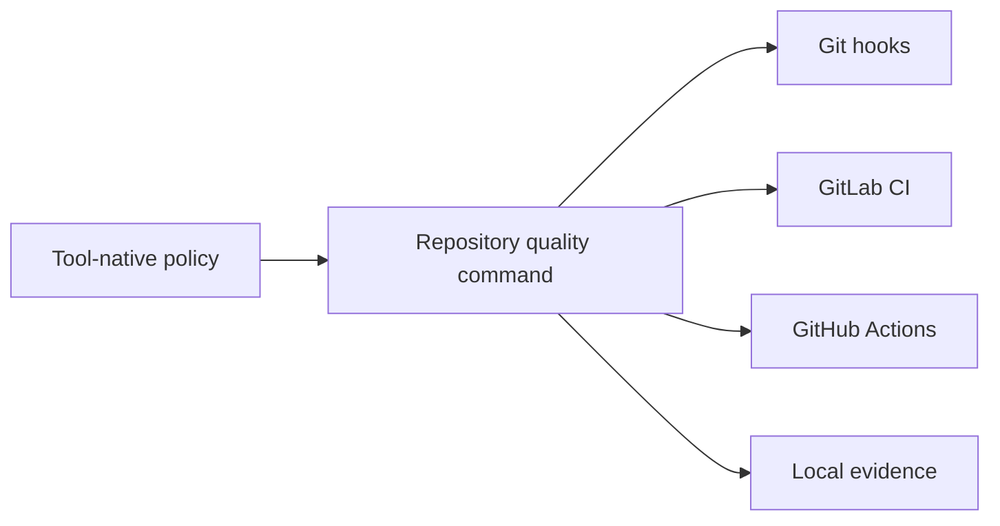
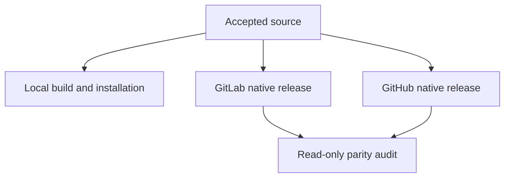

# Terminal Product Design

## 1. Product boundary

Codex Responses Proxy is a local Responses data plane and native lifecycle
product. It is not a Codex history editor, client control plane, credential
store, or Forge bridge.



| Owner | Owns |
| --- | --- |
| Codex | Conversations, JSONL, SQLite, stored items, model metadata |
| Client control plane | Credentials, provider selection, client configuration |
| Proxy | Provider-portable wire behavior, listener, native lifecycle, product CLI |
| Provider | Execution, quota, upstream availability |
| Each Forge | Its own CI, tag, Release, and assets |

## 2. UX and DX

UX and DX share truth but not entrypoints.

| Surface | UX | DX |
| --- | --- | --- |
| Entry | `codex-responses-proxy` | `uv` and `nox` owner sessions |
| Environment | Native executable; no Python or checkout | Repository-owned locked environments |
| Output | Human lifecycle view or explicit JSON | Reproducible diagnostics and artifacts |
| Documentation | Install, operate, diagnose | Build, test, release, architecture |

The public grammar remains:

```text
install
status
doctor
reload
uninstall
version
```

Python modules, repository scripts, private service roles, and release-operator
commands do not appear in end-user paths or help.

One result model feeds human and JSON projections. Human output is aligned by
display width, width-aware, quiet on success, and actionable on failure. JSON is
stable, secret-free, and styling-independent.

## 3. Semantic physical structure

The repository is organized by product responsibility rather than file type.



| Package | Contract |
| --- | --- |
| `cli` | Public parsing, result presentation, exit semantics |
| `providers` | Manifest registry and optional pure provider policy |
| `protocol` | Closed request/response projection and rejection |
| `relay` | HTTP/SSE admission, upstream exchange, recovery, cooldown |
| `service` | Listener, health, logs, private control and handoff |
| `lifecycle` | Artifact trust, payload transaction, supervision and removal |

Tests mirror these owners. Root modules, generic buckets, forwarding facades,
re-export layers, aliases, and single-caller abstractions are removed unless a
separate invariant proves their value. Package dependency direction is enforced
by an import-boundary gate.

## 4. Provider portability

Every Responses attempt is projected before remote I/O.

- `store=false` is unconditional.
- Provider response, conversation, cache, item, search, and encrypted-reasoning
  bindings are removed.
- Portable dialogue and complete tool relationships are retained.
- Unknown or unsafe replay structures fail locally.
- A provider-specific extension is a pure policy selected from the manifest.
- An ordinary new provider changes one manifest table only.

Recovery policies share the same projected bytes and cannot restore removed
provider state.

| Condition | Maximum behavior |
| --- | --- |
| DMXAPI `477 empty_response` | One retry of the projected attempt |
| `response_failed` | Strictly shrinking pair-safe attempts and one final dialogue-only attempt |
| Invalid `input` union | One smaller current-dialogue attempt |
| Pre-content interruption | Retry only before substantive downstream commitment |
| `429` | Relay once and apply provider-scoped bounded cooldown |

The proxy owns no global ordinary-request queue. Client concurrency and provider
quota remain outside the proxy.

## 5. Native lifecycle



Installation consumes one native asset and external trust anchor. It does not
require a Forge, source checkout, Git, or Python. Reload performs same-payload
handoff; payload upgrade is install. Uninstall proves service absence and exact
owned-process exit before payload mutation.

## 6. Documentation system

Current documentation has one owner per reader task.

| Owner | Subject |
| --- | --- |
| `README.md` | Product, installation, operation |
| `CONTRIBUTING.md` | Development and verification |
| `docs/architecture/` | Product boundary and package dependencies |
| `docs/governance/` | Current invariants and release policy |
| `docs/operations/` | Executable Forge and runtime procedures |
| `docs/decisions/` | Durable decisions only |
| `docs/evidence/` | Evidence limits, not current product truth |
| `openspec/changes/archive/` | Immutable historical change records |

`docs/README.md` is the documentation registry. It links each current document
once and names its unique subject; no second registry file is added.

Current docs use short prose, Mermaid for relationships, tables for ownership
and comparison, lists for rules, and code blocks for exact commands. ASCII
arrows are not used as diagrams. Markdown lint and Lychee prove syntax and
links. Archived OpenSpec and evidence are not rewritten for style.

## 7. Quality architecture

Every concern has one policy owner, one reusable execution owner, and thin
hook/CI projections.



| Concern | Tool or owner |
| --- | --- |
| Format and Python lint | Ruff |
| Types | Ty |
| Tests | Pytest |
| Statement and branch coverage | Coverage.py; each strictly above 95% |
| Import boundaries | Import Linter |
| Markdown | markdownlint-cli2 |
| Links | Lychee |
| Shell | ShellCheck and shfmt |
| GitHub workflow syntax | actionlint |
| GitHub workflow security | Zizmor |
| Secrets | Gitleaks |
| Python vulnerabilities | pip-audit against the locked environment |
| SBOM | One deterministic release SBOM owner |
| Structure, ELOC, complexity, residue | Repository architecture gate plus `scc` trend evidence |
| Examples and CLI | Black-box executable tests |

A tool is added only when it owns a distinct concern. CI does not restate
versions or command bodies. `pyproject.toml` remains concise; native config files
own tools that support explicit configuration elsewhere.

## 8. Supply chain

The repository targets the latest stable compatible release of every direct and
transitive dependency.

- `pyproject.toml` declares direct development dependencies.
- `uv.lock` is the complete dependency SSOT.
- Python 3.12, 3.13, and 3.14 remain blocking compatibility lanes.
- Update checks identify stable candidates; upgrades land only after full gates.
- Previews, release candidates, mutable branches, and ambient global packages
  are not admitted without an explicit product requirement.
- CI bootstraps the declared `uv` version once and derives the rest from the lock.

## 9. Local and independent publication



Local closure is Forge-free. GitLab and GitHub build, sign, upload, and publish
independently. Neither queries, waits for, downloads from, authenticates to, or
publishes through the other.

Parity compares version, equal source tree, and common-platform payload digests.
Provider-native signature bytes remain independent.

## 10. Lane and archive convergence

Every lane is classified by semantic delta, not directory age.

| Classification | Action |
| --- | --- |
| Unique required semantics | Reimplement or absorb under the terminal owner |
| Already represented by stronger current source/tests/spec | Prove coverage, then retire |
| Obsolete or contradictory semantics | Record rejection reason, then retire |
| Unknown ownership or unproved delta | Retain until exact evidence exists |

The old route-rejection lane is an ancestor of current `dev`; its route tests,
specification, and implementation must be mapped to current owners before
retirement.

Archive is history, not current authority. A completed change may be archived
only after its material semantics exist in canonical specs and no required task
is silently deferred. External publication and runtime acceptance remain
separate claims, but cannot be hidden as an unowned permanent post-archive list.

## 11. Acceptance

Completion requires current evidence for:

- exact UX/DX separation and native executable behavior;
- semantic package boundaries and zero unjustified flat residue;
- all quality gates and both coverage measures strictly above 95%;
- latest stable locked supply chain and vulnerability proof;
- local build, install, status, reload, runtime, and uninstall;
- UCloud, DMXAPI, and AIHubMix portability, empty-response, replay, and `429` behavior;
- independent green GitLab and GitHub publications and read-only parity;
- the original Codex conversation continuing without session-state mutation;
- every lane semantic delta absorbed, rejected, or retained with explicit proof;
- clean canonical roots and complete housekeeping.
