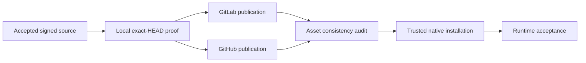

# Design

`VERSION` remains the only release-identity owner. `CHANGELOG.md` records why
v2.0.20 exists, and `README.md` derives its concrete installation examples from
that release. No release-only version constant is introduced elsewhere.

The same signed source commit is admitted independently by GitLab and GitHub.
Each Forge owns its tag, CI run, Release, and assets. Cross-Forge comparison is
read-only evidence after both native publication paths complete; it is never a
publication prerequisite.

Release completion is layered:

Failure in one layer preserves all earlier immutable evidence and is repaired
only by a later SemVer release when published identity has already escaped.
