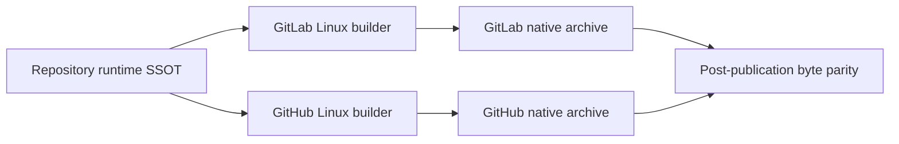

# Design

## Ownership

`pyproject.toml` owns the immutable Linux release image identity. Forge files
only project that value into their native container mechanism. `noxfile.py`
owns build execution and removes installer-only metadata before PyInstaller
collects the environment. `tools.release.assets` remains the single archive
normalizer and rejects provenance residue.

## Reproducibility contract

Both Linux jobs run the same image digest and architecture, materialize the
release commit from `git archive` at `/workspace`, and forbid automatic Python
downloads. The session checks the exact Python patch version before building,
uses deterministic environment variables, and strips `direct_url.json` and
`uv_cache.json` from the installed distribution. Forge checkout roots therefore
cannot enter the bundle, manifest, or archive bytes.

macOS and Windows remain native hosted builds because their assets are not
common across Forge planes. The cross-Forge parity requirement applies to the
common Linux asset; signatures remain intentionally provider-specific.

## Failure handling

Any image mismatch, Python patch drift, non-canonical build root, provenance
file, checkout path, or byte parity failure blocks release. Existing v2.0.25
tags, runs, and Releases remain immutable evidence; v2.0.26 is the only repair
path.
