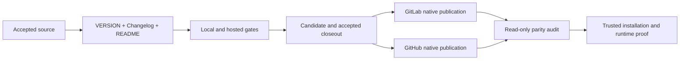

# Design

`VERSION` is the sole patch identity. Each Forge independently builds, signs,
publishes, and verifies its own tag, Release, and assets from the same accepted
tree; parity is observed only after both planes complete. The release does not
touch Codex conversation storage, JetBrains state, or provider runtime code.

The existing quality graph remains the implementation authority. This source
Change ends at accepted closeout; external delivery is neither required nor
asserted by its archive. The overall release continues immediately afterward
through the two independent Forge planes and trusted runtime acceptance.

This Change adds no compatibility path, duplicate version source, or second
publication owner.
