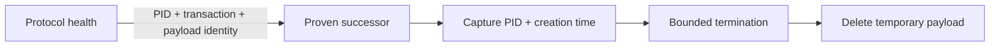

# Design

Process discovery continues to require exact executable and role arguments.
The new generation capture is narrower: callers may use it only after another
authority has proved the PID. Termination compares creation time before sending
a signal, so PID reuse cannot transfer authority.

## Requirement To Task To Proof

| Requirement | Task | Proof |
| --- | --- | --- |
| `process-ownership:protocol-proven successor capture` | `1.1` | `focused-generation-capture-regression` |
| `process-ownership:protocol-proven successor capture` | `1.2` | `pid-create-time-generation-binding` |
| `process-ownership:protocol-proven successor capture` | `1.3` | `successor-health-to-cleanup-ordering` |
| `process-ownership:protocol-proven successor capture` | `1.4` | `quick-quality-python-matrix-native-release` |
