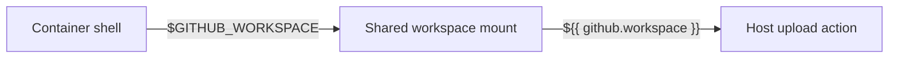

# Design

The two spellings intentionally belong to different evaluation planes but
identify the same mounted workspace. A contract test keeps that distinction
explicit and rejects reuse of the host expression in the container shell.
