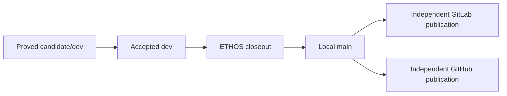

## Context

Accepted `dev` and release `main` are repository roles. Proxy owns its product
and release artifacts; ETHOS owns governed local role transitions. The accepted
repository specification already requires main promotion to use ETHOS closeout.

## Decision

Do not implement the originally proposed `tools/forge` promotion command.
Consume the repository's adopted package-only ETHOS command instead:

```text
ethos land --closeout --root <accepted-root> \
  --expect-head <accepted-head> --apply --authorize --json
```

The command observes the configured candidate and accepted roots, requires a
fresh exact-HEAD proof, and applies one compare-and-swap transition. A stale,
dirty, divergent, or unproved state fails before `main` moves.

## Boundary



GitLab and GitHub remain post-closeout peers. Neither Forge participates in the
local transition, and the local transition does not publish.

## Rejected alternative

A Proxy-owned `promote-release` command was rejected because it would duplicate
ETHOS's exact-CAS lifecycle authority and create two answers to the same state
transition.
