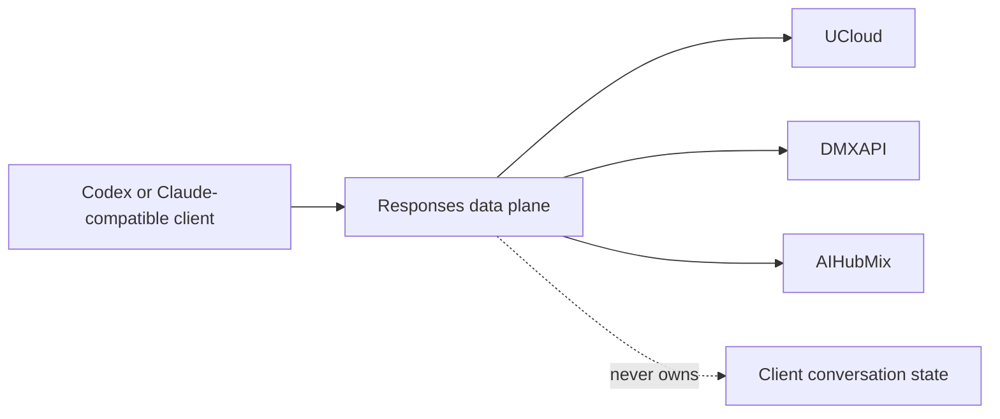

# Design

## Authority

The proxy owns one loopback Responses adapter, native lifecycle, and released
payload. Clients own configuration and conversation state. Providers remain
interchangeable peers behind one normalized protocol boundary.

## Lane absorption

Historical lanes are inputs, not authorities. For each lane:

1. Compare its product paths with current `dev`.
2. Rebuild a unique missing behavior in this lane with a failing test first.
3. Discard version noise, duplicate OpenSpec carriers, compatibility layers,
   and obsolete implementation.
4. Retire the source lane only after its useful semantics are proved absorbed.

No historical tree is merged wholesale.

The 2026-08-14 exact inventory leaves one current carrier:
`work/terminal-convergence`. The remaining Work Lane refs add no current
product behavior:

| Historical lane | Disposition | Current authority |
| --- | --- | --- |
| `work/github-container-workspace-path` | Absorbed | GitHub release verification already uses `$GITHUB_WORKSPACE` explicitly. |
| `work/windows-bundle-path-identity` | Absorbed | Current release assets preserve Windows path identity and tests cover it. |
| `work/20260814-install-full-release-checksums` | Absorbed | Current lifecycle consumes the complete signed manifest; its dirty rollback overlay is byte-identical to `dev`. |
| Other linked or unbound historical Work Lanes | Discardable carrier residue | Their only unmatched bytes are obsolete OpenSpec carriers or superseded release chronology. |

Retirement must preserve this classification evidence but must not copy the
historical carriers into the terminal product tree.

## Runtime invariants

| Concern | Single owner | Invariant |
| --- | --- | --- |
| Provider request | Responses normalization | Outbound storage is disabled. |
| Replay | Provider-portable replay | Provider-bound IDs never cross providers. |
| Empty response | Upstream recovery | Bounded retry and typed recovery preserve agent content. |
| Backpressure | Provider runtime | One provider's 429 state does not throttle peer providers. |
| Upgrade | Lifecycle transaction | Rollback restores prior bytes and removes candidate-only files. |
| Publication | Release pipeline | GitLab and GitHub consume the same signed revision independently. |

## Deletion rule

A dependency or abstraction is admitted only when it removes more accidental
complexity, ELOC, or platform risk than it adds. There is no parallel legacy
path. Python module entrypoints remain developer interfaces; users receive the
installed command.

## Verification boundary

Completion requires, from one source revision: strict local gates, statement,
branch, and package coverage above 95%, macOS/Linux/Windows evidence,
independent Forge publication, matching signed assets, clean installation,
three-provider runtime probes, and continuous reply in the original Codex
conversation without modifying its stored state.
