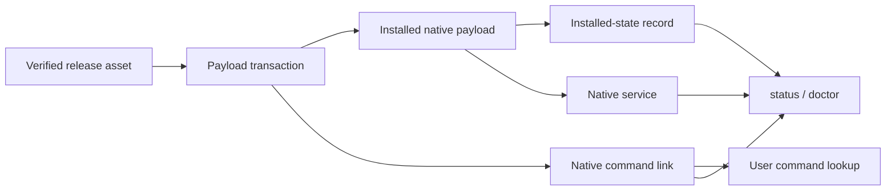

# Design

## Ownership

`lifecycle.command` owns one derived command path and its ownership checks.
`PayloadTransaction` remains the sole mutation coordinator. Installed state
remains the release identity owner.

## Platform projection

| Platform | Command directory |
|---|---|
| macOS and Linux | `XDG_BIN_HOME` when absolute; otherwise `~/.local/bin` |
| Windows | `LOCALAPPDATA/Microsoft/WindowsApps` |

An explicit `XDG_BIN_HOME` is rejected when relative. Windows uses the
per-user application-alias directory already present in the user environment;
the installer does not change machine or user `PATH`.

## Transaction

Before payload mutation, the transaction snapshots the command-path state as
one of: absent or an exact product-owned link. A foreign file, directory, or
link blocks the installation before mutation.

After the candidate executable is written, the transaction atomically replaces
the command link. Rollback restores the prior link or its prior absence. A
fresh-install service failure and an upgrade handoff failure therefore restore
both payload and command projection. Finalization records no second command
state; ownership is always re-proved from the live link target.

## Read and removal semantics

`status` reads release identity from canonical installed state and reports the
command path plus whether it resolves to the exact installed executable.
`doctor` consumes the same result model and adds one command check. Uninstall
removes the link only after service removal and only while ownership still
matches. `--purge` continues to govern payload removal independently.

## Failure policy

- Foreign command targets fail closed before mutation.
- Relative or unusable command-directory configuration fails closed.
- A command link changed by another actor is preserved during rollback and
  uninstall; the operation reports the ownership conflict.
- No directory-wide deletion is permitted.
