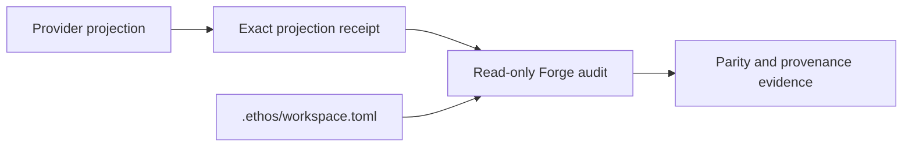

# Design

Publication already emits one exact mapping receipt per Forge. The audit now
consumes that receipt instead of inventing a second continuity configuration.

| Input | Authority |
| --- | --- |
| Persistent branch roles | `.ethos/workspace.toml` |
| Current provider tip | Fresh isolated fetch |
| Trust epoch | Projection receipt bound to that tip |
| Commit and tag trust | Explicit external allowed-signers files |

This keeps publication and audit separate: publication creates the provider
history and immutable receipt; audit only verifies the observed result.
