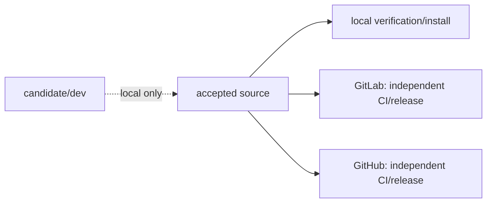

## Design

`.ethos/release.toml` is the single publication declaration. It names remote
aliases and tracked CI surfaces, not Forge URLs or credentials. Git metadata
resolves those aliases at execution time. The two Forge projections share the
same source commit and asset contract but never consume each other's status or
release artifacts.

The declaration invokes the repository-local product executable for installation.
That path is a DX-only bootstrap surface; the installed UX remains the bare
`codex-responses-proxy` command.

The local install command names the public executable and two operator-provided
environment variables:

| Variable | Meaning |
| --- | --- |
| `CODEX_RESPONSES_PROXY_RELEASE_ASSET` | Absolute or relative path to the verified platform archive. |
| `CODEX_RESPONSES_PROXY_RELEASE_TRUST_ANCHOR` | Path to the organization-supplied SSH allowed-signers file. |

Neither variable is stored by the repository or inferred from a workstation.
